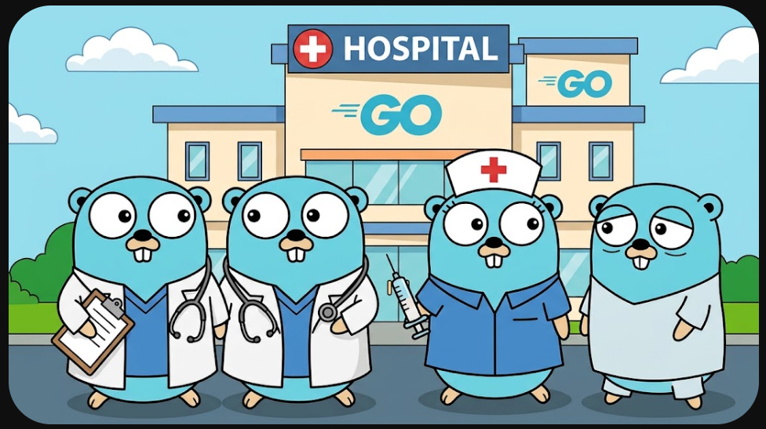

<p align="center">
  
</p>

<h2 align="center">HOSIM-GO (Hospital Information Management System in Go)</h2>

<p align="center">
  
  
  
  
  
  
</p>

HOSIM-GO adalah sistem informasi manajemen rumah sakit (SIMRS) dan rekam medis elektronik (EHR / RME) modern berbasis **Go (Gin)** dan **Svelte 5 (Runes)**. Didesain untuk performa tinggi, keandalan operasional, dan kepatuhan standar interoperabilitas kesehatan (Kemenkes SATUSEHAT & BPJS Kesehatan).

> [!NOTE]
> ### ⚠️ Pembelajaran & Kolaborasi
> Proyek ini dikembangkan secara mandiri untuk kebutuhan pembelajaran dan eksplorasi teknologi SIMRS modern.
> Diskusi, masukan, dan kontribusi sangat terbuka. Hubungi: **gunawansuarna@gmail.com**.

---

## 🛠️ Tech Stack

| Layer | Label & Komponen Utama |
| :--- | :--- |
| **Backend** |       |
| **Frontend** | -FF3E00?style=flat-square&logo=svelte&logoColor=white)     |
| **Interoperabilitas** | -009B4D?style=flat-square)  |

---

## ✨ Fitur Utama

- **Rekam Medis Elektronik (RME / EHR)**:
  - Interactive Body Diagram (Status Lokalis) berbasis SVG dengan pemetaan cedera/nyeri NRS.
  - Catatan Medis Terstruktur (SOAP & ICD-10/ICD-9).
  - Odontogram interaktif (32 gigi FDI standard).
  - Order Penunjang (Laboratorium, Radiologi, E-Resep).
- **Alur Pelayanan & Care Settings**:
  - Gawat Darurat (IGD), Rawat Jalan (Poliklinik), dan Rawat Inap (Bangsal/Kamar).
- **Master Data Rumah Sakit**:
  - Pasien, Tenaga Medis (Dokter/Perawat), Departemen, Unit Layanan, Ruangan/Bed, Penjamin/Asuransi, Faskes Rujukan, dan Tarif.
- **Keamanan & RBAC**:
  - Otentikasi berbasis JWT, role-based access control, dan audit log aktivitas.

---

## 🚀 Memulai (Quick Start)

### Prasyarat
- **Go** v1.22+
- **Node.js** v18+ atau v20+ & **npm**
- **PostgreSQL** aktif

### 1. Backend (Go API)

1. Salin dan sesuaikan konfigurasi database di `.env`:
   ```bash
   cp .env.example .env
   ```
2. Jalankan migrasi dan seeder awal:
   ```bash
   go run cmd/migrate/main.go up
   go run cmd/seed/main.go
   ```
3. Jalankan server backend:
   ```bash
   go run cmd/api/main.go
   ```
   API berjalan di `http://localhost:8080`. Health check: `http://localhost:8080/health`.

### 2. Frontend (Svelte 5 App)

1. Masuk ke direktori web dan instal dependensi:
   ```bash
   cd web
   npm install
   ```
2. Jalankan development server:
   ```bash
   npm run dev
   ```
   Buka browser di `http://127.0.0.1:5173`.
   *(Preset login cepat tersedia di halaman login: Dokter / Admin)*.

---

## 📖 Panduan Teknis & Arsitektur

Detail arsitektur Clean Architecture, aturan modular monolith, konvensi penulisan kode, boundary transaksi, dan panduan engineering selengkapnya dapat dibaca di:
👉 **[AGENTS.md](AGENTS.md)**

---

## 📜 Lisensi

Didistribusikan di bawah lisensi [MIT](LICENSE).
