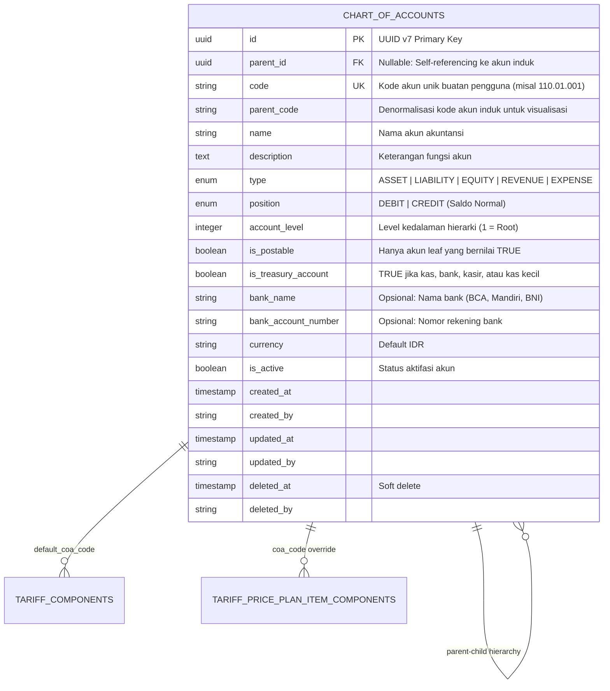

# Product Requirement Document (PRD): Chart of Accounts (COA) Domain

## 1. Ringkasan Eksekutif & Tujuan

Domain `internal/accounting` bertindak sebagai **fondasi akuntansi dan pelaporan keuangan rumah sakit** di HOSIM-GO. Modul ini bertanggung jawab atas standardisasi bagan akun (*Chart of Accounts* / COA), pemetaan struktur hierarki multi-level, penentuan saldo normal (*position* Debit/Kredit), klasifikasi akun perbendaharaan/kas-bank (*treasury accounts*), serta integrasi kode akun ke pos tarif tindakan medis ([`internal/finance/tariffcomponent`](file:///c:/laragon/www/hosim-go/internal/finance/tariffcomponent)) dan buku tarif ([`internal/finance/priceplan`](file:///c:/laragon/www/hosim-go/internal/finance/priceplan)).

PRD ini dirancang secara **pragmatis, terstandar, dan aman**:
1. **Hierarki Akun Fleksibel & Terkendali**: Mendukung struktur pohon (*tree structure*) multi-level dengan kalkulasi kedalaman level otomatis (`account_level`).
2. **Pemisahan Header & Detail (`is_postable`)**: Akun header/induk bertindak murni sebagai pengelompokan rollup, sedangkan posting transaksi jurnal hanya diizinkan pada akun detail (daun/*leaf*).
3. **Standar Akuntansi Rumah Sakit Indonesia**: Klasifikasi 5 tipe utama (`ASSET`, `LIABILITY`, `EQUITY`, `REVENUE`, `EXPENSE`) dengan aturan saldo normal baku dan dukungan akun kontra.
4. **Flag Perbendaharaan (`is_treasury_account`)**: Penandaan eksplisit akun kas, kas kecil (*petty cash*), dan rekening bank untuk integrasi modul kasir (*cashier*), penerimaan billing, dan disbursement.
5. **Integritas Penghapusan (Immutability & Restrict)**: Mencegah penghapusan akun yang memiliki anak (*child accounts*) atau yang sudah direferensikan dalam katalog tarif dan transaksi finansial.

---

## 2. Arsitektur Data & Model Relasional

Bagan akun menghubungkan seluruh transaksi finansial operasional rumah sakit ke sistem buku besar.



---

## 3. Spesifikasi Kolom & Integritas Basis Data

### 3.1 Tabel `chart_of_accounts`

| Kolom | Tipe Data | Constraint | Penjelasan |
|---|---|---|---|
| `id` | `VARCHAR(36)` | Primary Key | UUID v7 |
| `parent_id` | `VARCHAR(36)` | FK, Nullable, `ON DELETE RESTRICT` | Merujuk ke `chart_of_accounts.id`. `NULL` jika akun root level 1 |
| `code` | `VARCHAR(50)` | Not Null | Kode akun terstruktur (misal: `1000`, `1100`, `1110.01`) |
| `parent_code` | `VARCHAR(50)` | Nullable | Salinan kode akun induk untuk kueri cepat & pelaporan |
| `name` | `VARCHAR(150)` | Not Null | Nama akun (misal: "Kas Kecil Farmasi", "Piutang BPJS") |
| `description` | `TEXT` | Nullable | Penjelasan peruntukan dan aturan pencatatan |
| `type` | `VARCHAR(30)` | Not Null | Klasifikasi: `ASSET`, `LIABILITY`, `EQUITY`, `REVENUE`, `EXPENSE` |
| `position` | `VARCHAR(10)` | Not Null | Saldo normal: `DEBIT` atau `CREDIT` |
| `account_level` | `INTEGER` | Not Null, Default 1 | Kedalaman tingkat hierarki (1, 2, 3, 4, 5) |
| `is_postable` | `BOOLEAN` | Not Null, Default true | Apakah akun boleh menerima mutasi jurnal |
| `is_treasury_account` | `BOOLEAN` | Not Null, Default false | Penanda akun kas/bank/kasir perbendaharaan |
| `bank_name` | `VARCHAR(100)` | Nullable | Nama perbankan jika akun berupa rekening bank |
| `bank_account_number` | `VARCHAR(50)` | Nullable | Nomor rekening giro/tabungan operasional |
| `currency` | `VARCHAR(10)` | Not Null, Default 'IDR' | Mata uang standar pencatatan |
| `is_active` | `BOOLEAN` | Not Null, Default true | Status aktif untuk pilihan dropdown transaksi |
| `created_at` | `TIMESTAMPTZ` | Not Null, Default CURRENT_TIMESTAMP | Jejak waktu pembuatan |
| `created_by` | `VARCHAR(50)` | Not Null, Default 'SYSTEM' | User pembuat akun |
| `updated_at` | `TIMESTAMPTZ` | Not Null, Default CURRENT_TIMESTAMP | Jejak waktu perubahan terakhir |
| `updated_by` | `VARCHAR(50)` | Not Null, Default 'SYSTEM' | User pengubah akun |
| `deleted_at` | `TIMESTAMPTZ` | Nullable | Waktu soft delete |
| `deleted_by` | `VARCHAR(50)` | Nullable | User penghapus |

---

### 3.2 Indeks & Integritas Database (Constraints)

1. **Unique Code Constraint**:
   ```sql
   CREATE UNIQUE INDEX idx_chart_of_accounts_code ON chart_of_accounts(code) WHERE deleted_at IS NULL;
   ```
   *Memastikan tidak boleh ada dua akun aktif dengan kode yang sama.*

2. **Index Pencarian & Hierarki**:
   ```sql
   CREATE INDEX idx_chart_of_accounts_parent_id ON chart_of_accounts(parent_id);
   CREATE INDEX idx_chart_of_accounts_type ON chart_of_accounts(type);
   CREATE INDEX idx_chart_of_accounts_is_postable ON chart_of_accounts(is_postable);
   CREATE INDEX idx_chart_of_accounts_is_treasury ON chart_of_accounts(is_treasury_account);
   CREATE INDEX idx_chart_of_accounts_is_active ON chart_of_accounts(is_active);
   ```

3. **Check Constraints**:
   - `CHECK (position IN ('DEBIT', 'CREDIT'))`
   - `CHECK (type IN ('ASSET', 'LIABILITY', 'EQUITY', 'REVENUE', 'EXPENSE'))`
   - `CHECK (account_level >= 1)`

---

## 4. Invariant & Aturan Bisnis (Non-Negotiable)

### 4.1 Hubungan Tipe Akun & Saldo Normal (*Default Position*)

Berdasarkan persamaan dasar akuntansi, posisi default ditentukan secara otomatis saat akun dibuat:

| Tipe Akun (`type`) | Posisi Default (`position`) | Sifat Peningkatan Nilai | Contoh di RS |
|---|---|---|---|
| `ASSET` | `DEBIT` | Bertambah di Debit | Kas, Bank, Piutang Pasien, Persediaan Obat |
| `LIABILITY` | `CREDIT` | Bertambah di Kredit | Hutang PBF, Hutang Jasa Medis Dokter |
| `EQUITY` | `CREDIT` | Bertambah di Kredit | Modal RS, Saldo Laba Ditahan |
| `REVENUE` | `CREDIT` | Bertambah di Kredit | Pendapatan Rawat Inap, Pendapatan Farmasi |
| `EXPENSE` | `DEBIT` | Bertambah di Debit | Beban Gaji, Beban Pemeliharaan Alat Medis |

*Catatan Override*: Sistem mengizinkan override manual posisi akun khusus untuk **Akun Kontra**, contohnya:
- `Akumulasi Penyusutan Gedung/Alat Medis`: Tipe `ASSET`, Saldo Normal `CREDIT`.
- `Prive / Deviden`: Tipe `EQUITY`, Saldo Normal `DEBIT`.
- `Diskon/Retur Penjualan Farmasi`: Tipe `REVENUE`, Saldo Normal `DEBIT`.

---

### 4.2 Aturan Hierarki & Pemeliharaan Status `is_postable`

1. **Perhitungan Otomatis `account_level`**:
   - Akun Root (`parent_id = NULL`): `account_level = 1`.
   - Akun Anak: `account_level = parent.account_level + 1`.
2. **Aturan Mutasi `is_postable`**:
   - Akun baru yang tidak memiliki anak otomatis diset `is_postable = true`.
   - Ketika sebuah akun didaftarkan menjadi `parent_id` bagi akun baru, sistem **secara otomatis mengubah status akun induk tersebut menjadi `is_postable = false`**.
   - Akun dengan status `is_postable = false` **DILARANG** dipilih dalam transaksi penjurnalan, billing kasir, atau pemetaan komponen tarif.
3. **Konsistensi Tipe Hierarki**:
   - Akun anak **WAJIB** mewarisi `type` yang sama dengan akun induknya (misal: anak dari akun `ASSET` harus bertipe `ASSET`).

---

### 4.3 Validasi Akun Perbendaharaan (`is_treasury_account`)

1. Akun hanya boleh diset `is_treasury_account = true` apabila:
   - `type == 'ASSET'` (Aset Lancar / Kas & Setara Kas).
   - `is_postable == true` (Akun detail/daun, bukan kategori header).
2. Jika sebuah akun kas/bank dipilih saat penerimaan pembayaran kasir, pencatatan otomatis debit dialokasikan ke akun ini.

---

### 4.4 Aturan Penghapusan & Keamanan Data (Deletion Policy)

1. **Larangan Hapus Akun Induk**: Akun yang masih memiliki minimal 1 akun anak aktif (`parent_id = id AND deleted_at IS NULL`) **DILARANG DIHAPUS**.
2. **Larangan Hapus Akun Terikat Tarif**: Akun yang kodenya telah digunakan pada `tariff_components.default_coa_code` atau `tariff_price_plan_item_components.coa_code` tidak boleh dihapus.
3. **Pemberlakuan Soft Delete**: Penghapusan yang sah hanya melakukan pengisian `deleted_at` dan `deleted_by` tanpa menghilangkan data audit historis.
4. **Penonaktifan (`is_active = false`)**: Akun yang sudah tidak digunakan disarankan diubah menjadi non-aktif alih-alih dihapus.

---

## 5. Standar Data Awal (Seed Data COA Rumah Sakit Indonesia)

Bagan akun bawaan yang disediakan sistem mengikuti standar akuntansi rumah sakit (Permenkes RI / Standar Akuntansi Keuangan):

```text
1000 - ASET (Level 1, Header)
  ├── 1100 - ASET LANCAR (Level 2, Header)
  │     ├── 1110 - Kas dan Setara Kas (Level 3, Header)
  │     │     ├── 1111 - Kas Kasir Utama (Level 4, Postable, Treasury)
  │     │     ├── 1112 - Kas Kecil Depo Farmasi & IGD (Level 4, Postable, Treasury)
  │     │     ├── 1113 - Bank Mandiri Operasional (Level 4, Postable, Treasury)
  │     │     └── 1114 - Bank BCA Operasional (Level 4, Postable, Treasury)
  │     ├── 1120 - Piutang Pelayanan Pasien (Level 3, Header)
  │     │     ├── 1121 - Piutang Pasien Umum / Pribadi (Level 4, Postable)
  │     │     ├── 1122 - Piutang BPJS Kesehatan (Level 4, Postable)
  │     │     └── 1123 - Piutang Asuransi Swasta & Korporasi (Level 4, Postable)
  │     └── 1130 - Persediaan Medis & Non-Medis (Level 3, Header)
  │           ├── 1131 - Persediaan Obat-Obatan Farmasi (Level 4, Postable)
  │           ├── 1132 - Persediaan Bahan Medis Habis Pakai / BMHP (Level 4, Postable)
  │           └── 1133 - Persediaan Logistik Umum & ATK (Level 4, Postable)
  └── 1200 - ASET TETAP (Level 2, Header)
        ├── 1210 - Peralatan Medis & Laboratorium (Level 3, Postable)
        └── 1219 - Akumulasi Penyusutan Alat Medis (Level 3, Postable, Position: CREDIT [Kontra])

2000 - LIABILITAS (Level 1, Header)
  ├── 2100 - LIABILITAS JANGKA PENDEK (Level 2, Header)
  │     ├── 2110 - Hutang Usaha / Pembelian Obat PBF (Level 3, Postable)
  │     ├── 2120 - Hutang Jasa Medis Dokter (Level 3, Postable)
  │     ├── 2130 - Hutang Sewa Alat Medis Rekanan (Level 3, Postable)
  │     └── 2140 - Uang Muka Biaya Rawat Inap (Level 3, Postable)

3000 - EKUITAS (Level 1, Header)
  ├── 3100 - Modal Disetor / Modal Pemilik (Level 2, Postable)
  └── 3200 - Saldo Laba Ditahan (Level 2, Postable)

4000 - PENDAPATAN OPERASIONAL (Level 1, Header)
  ├── 4100 - Pendapatan Pelayanan Medis RS (Level 2, Header)
  │     ├── 4101 - Pendapatan Jasa Sarana & Kamar RS (Level 3, Postable)
  │     ├── 4102 - Pendapatan Jasa Medis Tindakan Dokter (Level 3, Postable)
  │     ├── 4103 - Pendapatan Jasa Paramedis & Asuhan Keperawatan (Level 3, Postable)
  │     └── 4104 - Pendapatan Tindakan Laboratorium & Radiologi (Level 3, Postable)
  └── 4200 - Pendapatan Farmasi & BMHP (Level 2, Header)
        ├── 4201 - Pendapatan Penjualan Obat Rawat Jalan (Level 3, Postable)
        └── 4202 - Pendapatan Penjualan Obat Rawat Inap (Level 3, Postable)

5000 - BEBAN OPERASIONAL (Level 1, Header)
  ├── 5100 - Harga Pokok Penjualan / HPP Obat & BMHP (Level 2, Postable)
  ├── 5200 - Beban Jasa Dokter & Tenaga Medis (Level 2, Postable)
  ├── 5300 - Beban Gaji & Kesejahteraan Karyawan (Level 2, Postable)
  └── 5400 - Beban Pemeliharaan & Operasional Sarana RS (Level 2, Postable)
```

---

## 6. Desain Endpoint REST API

Semua rute bernaung di bawah prefix `/api/v1/accounting/accounts` dan diotorisasi menggunakan RBAC middleware.

### 6.1 Daftar Endpoint

| Method | Endpoint | Permission | Penjelasan |
|---|---|---|---|
| `GET` | `/api/v1/accounting/accounts` | `accounting:read` | List akun flat/paginasi dengan filter `type`, `is_postable`, `is_treasury`, `search` |
| `GET` | `/api/v1/accounting/accounts/tree` | `accounting:read` | Mengambil hierarki pohon lengkap (*nested tree structure*) untuk visualisasi UI |
| `GET` | `/api/v1/accounting/accounts/postable` | `accounting:read` | Shortcut daftar akun yang siap dipilih untuk transaksi (`is_postable=true`, `is_active=true`) |
| `GET` | `/api/v1/accounting/accounts/treasury` | `accounting:read` | Shortcut daftar akun kas/bank untuk modul kasir & billing |
| `GET` | `/api/v1/accounting/accounts/:id` | `accounting:read` | Ambil detail satu akun |
| `POST` | `/api/v1/accounting/accounts` | `accounting:create` | Buat akun baru (otomatis set level & update parent postable) |
| `PUT` | `/api/v1/accounting/accounts/:id` | `accounting:update` | Update metadata akun (nama, deskripsi, posisi, info bank, status aktif) |
| `DELETE` | `/api/v1/accounting/accounts/:id` | `accounting:delete` | Soft delete akun (divalidasi tidak memiliki child & tidak terpakai tarif) |

---

### 6.2 Contoh Kontrak Request & Response

#### Request: Buat Akun Baru (`POST /api/v1/accounting/accounts`)
```json
{
  "code": "1115",
  "name": "Bank BSI Syariah Operasional",
  "parent_id": "01a10000-0000-7000-0000-000000001110",
  "type": "ASSET",
  "position": "DEBIT",
  "description": "Rekening operasional penerimaan klaim BPJS",
  "is_treasury_account": true,
  "bank_name": "Bank Syariah Indonesia",
  "bank_account_number": "7112233445",
  "currency": "IDR",
  "is_active": true
}
```

#### Response: Single Account Detail
```json
{
  "status": "success",
  "code": 201,
  "message": "Akun bagan berhasil dibuat",
  "data": {
    "id": "01a10955-9701-704a-a2d4-8a3a6aae5d89",
    "code": "1115",
    "parent_id": "01a10000-0000-7000-0000-000000001110",
    "parent_code": "1110",
    "name": "Bank BSI Syariah Operasional",
    "description": "Rekening operasional penerimaan klaim BPJS",
    "type": "ASSET",
    "position": "DEBIT",
    "account_level": 4,
    "is_postable": true,
    "is_treasury_account": true,
    "bank_name": "Bank Syariah Indonesia",
    "bank_account_number": "7112233445",
    "currency": "IDR",
    "is_active": true,
    "created_at": "2026-10-05T09:00:00Z",
    "updated_at": "2026-10-05T09:00:00Z"
  }
}
```

#### Response: Tree Structure (`GET /api/v1/accounting/accounts/tree`)
```json
{
  "status": "success",
  "code": 200,
  "message": "Struktur pohon bagan akun berhasil diambil",
  "data": [
    {
      "id": "01a10000-0000-7000-0000-000000001000",
      "code": "1000",
      "name": "ASET",
      "type": "ASSET",
      "position": "DEBIT",
      "account_level": 1,
      "is_postable": false,
      "children": [
        {
          "id": "01a10000-0000-7000-0000-000000001100",
          "code": "1100",
          "name": "ASET LANCAR",
          "type": "ASSET",
          "position": "DEBIT",
          "account_level": 2,
          "is_postable": false,
          "children": []
        }
      ]
    }
  ]
}
```

---

## 7. Service Contract & Interface

Mengikuti arsitektur **Jalur B (Business Transaction)** di [`AGENTS.md`](file:///c:/laragon/www/hosim-go/AGENTS.md#L39):

```go
type AccountService interface {
    // Dipanggil saat penambahan akun baru
    CreateAccount(ctx context.Context, cmd CreateAccountCommand) (*AccountResponse, error)
    
    // Dipanggil saat pengubahan metadata akun
    UpdateAccount(ctx context.Context, id string, cmd UpdateAccountCommand) (*AccountResponse, error)
    
    // Dipanggil saat menghapus akun (dengan validasi child & referensi tarif)
    DeleteAccount(ctx context.Context, id string, operator string) error
    
    // Query path pembacaan detail, list, dan tree
    GetByID(ctx context.Context, id string) (*AccountResponse, error)
    GetByCode(ctx context.Context, code string) (*AccountResponse, error)
    List(ctx context.Context, params AccountListParams) ([]AccountResponse, int64, error)
    GetTree(ctx context.Context, activeOnly bool) ([]AccountTreeNode, error)
    ListPostable(ctx context.Context) ([]AccountResponse, error)
    ListTreasury(ctx context.Context) ([]AccountResponse, error)
}
```

---

## 8. Struktur Kode & Organisasi Package

Sesuai pola modular monolith di HOSIM-GO (sebagaimana diterapkan pada [`internal/inventory`](file:///c:/laragon/www/hosim-go/internal/inventory)):

```text
internal/accounting/
├── PRD.md              <- Dokumen spesifikasi kebutuhan produk (file ini)
├── doc.go              <- Dokumentasi package accounting
├── entity.go           <- Struct domain ChartOfAccount, Enum Type, Position, UUID v7
├── dto.go              <- Request & Response DTO serta TreeNode representation
├── repository.go       <- Port & implementasi database (query GORM, recursive CTE tree, transaction)
├── service.go          <- Logika bisnis: level calculation, parent update, delete validation
├── handler.go          <- Gin HTTP Handler & pendaftaran rute /api/v1/accounting/accounts
├── seeder.go           <- Seed data bagan akun standar RS Indonesia (Permenkes RI)
└── service_test.go     <- Unit test validasi hierarki, tree mapping, & invariant postable
```
