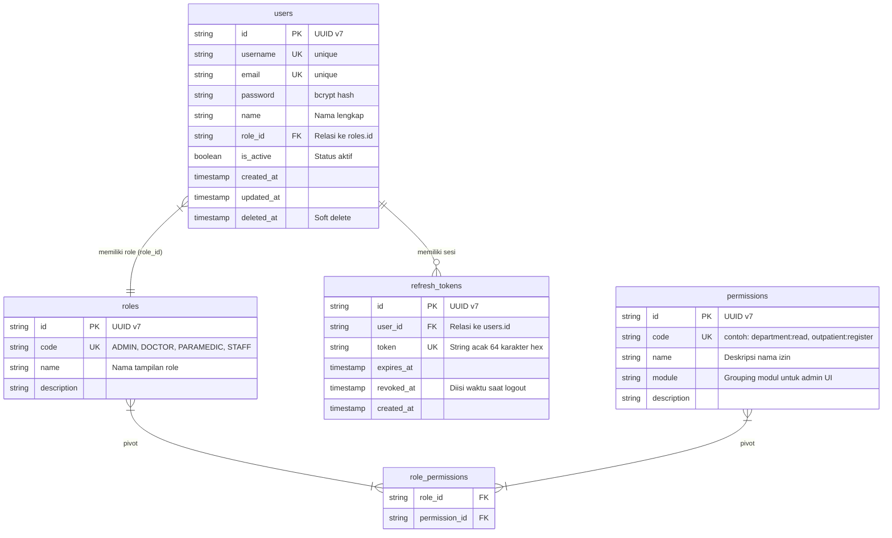
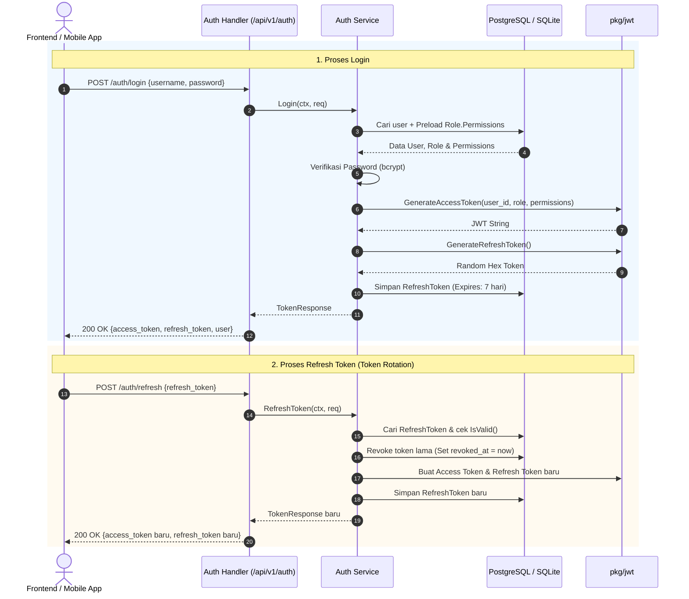
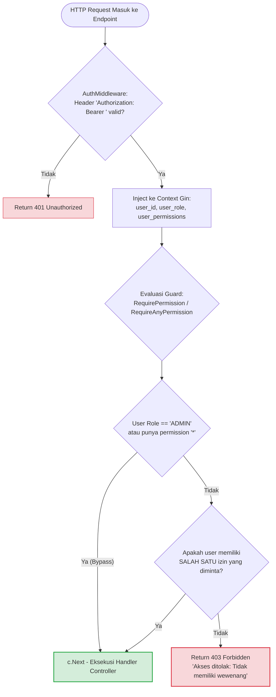

# Dokumentasi Modul Autentikasi & RBAC (`internal/auth`)

Dokumen ini ditujukan bagi maintainer dan developer untuk memahami arsitektur, skema database, alur kerja autentikasi, serta cara memperluas sistem otorisasi (**Role-Based Access Control / RBAC**) di backend **`hosim-go`**.

---

## 1. Filosofi & Desain Arsitektur

Modul ini dibangun menggunakan 2 pilar utama:
1. **Hybrid Dual-Token Authentication**:
   - **Access Token (JWT)**: Berumur pendek (15 menit), stateless, membawa klaim identitas (`user_id`, `username`, `role`) serta daftar kode `permissions`.
   - **Refresh Token (Database)**: Berumur panjang (7 hari), string acak kriptografis (`crypto/rand`) tersimpan di tabel `refresh_tokens`. Mendukung *Token Rotation* dan *Instant Revocation* (logout).
2. **Fine-Grained Permission-Based RBAC ( Fleksibel / Multiple Permissions)**:
   - User tidak hanya dibatasi oleh nama role, melainkan oleh kode permission spesifik (`module:action`).
   - Endpoint pendukung (seperti data master dokter yang dibutuhkan di form pendaftaran rawat jalan) menggunakan `RequireAnyPermission(...)` sehingga staf non-admin dapat memanggil endpoint tersebut tanpa bentrok `403 Forbidden`.

---

## 2. Diagram Relasi Database (ERD)



---

## 3. Diagram Alur Kerja (Workflows)

### A. Alur Autentikasi (Login & Refresh Token)



---

### B. Alur Otorisasi Middleware (`RequireAnyPermission` - Opsi 1)



---

## 4. Struktur File & Tanggung Jawab Komponen

| File | Tanggung Jawab |
| :--- | :--- |
| [`entity.go`](file:///c:/laragon/www/hosim-go/internal/auth/entity.go) | Mendefinisikan model GORM: `User`, `Role`, `Permission`, dan `RefreshToken`. |
| [`dto.go`](file:///c:/laragon/www/hosim-go/internal/auth/dto.go) | Struct request/response: `LoginRequest`, `RegisterRequest`, `UserResponse`, `TokenResponse`. |
| [`repository.go`](file:///c:/laragon/www/hosim-go/internal/auth/repository.go) | Akses database GORM dengan otomatis melakukan `Preload("Role.Permissions")`. |
| [`service.go`](file:///c:/laragon/www/hosim-go/internal/auth/service.go) | Logika bisnis autentikasi, hashing password bcrypt, rotasi token, dan penyusunan permissions. |
| [`handler.go`](file:///c:/laragon/www/hosim-go/internal/auth/handler.go) | Routing endpoint HTTP `/api/v1/auth/*`. |
| [`seeder.go`](file:///c:/laragon/www/hosim-go/internal/auth/seeder.go) | Seeder awal: mendaftarkan master permissions, default roles (`ADMIN`, `DOCTOR`, `PARAMEDIC`, `STAFF`), dan default user `admin`. |
| [`internal/middleware/auth.go`](file:///c:/laragon/www/hosim-go/internal/middleware/auth.go) | Middleware `AuthMiddleware`, `RequirePermission`, `RequireAnyPermission`, dan `RequireRole`. |
| [`pkg/jwt/jwt.go`](file:///c:/laragon/www/hosim-go/pkg/jwt/jwt.go) | Helper independen untuk pembuatan & validasi JWT Access Token serta random refresh token. |

---

## 5. Panduan untuk Developer & Maintainer

### A. Cara Memproteksi Endpoint Baru

Gunakan fungsi middleware di package [`hosim-go/internal/middleware`](file:///c:/laragon/www/hosim-go/internal/middleware/auth.go):

#### 1. Kunci Ketat (1 Izin Spesifik)
Gunakan untuk aksi manipulasi data sensitif (`POST`, `PUT`, `DELETE`):
```go
departments.POST("", middleware.RequirePermission("department:create"), h.Create)
departments.DELETE("/:id", middleware.RequirePermission("department:delete"), h.Delete)
```

#### 2. Kunci Fleksibel (Opsi 1: Salah Satu Cocok / OR)
Gunakan untuk endpoint data yang dibutuhkan oleh banyak divisi/modul lain:
```go
// Endpoint daftar dokter bisa diakses oleh Admin Master ATAU Suster pendaftaran rawat jalan
practitioners.GET("", middleware.RequireAnyPermission(
    "practitioner:read",   // Diizinkan untuk Admin HR/Master
    "outpatient:register", // Diizinkan untuk Suster pendaftaran poli
    "appointment:view",    // Diizinkan untuk Petugas janji temu
), h.List)
```

> **Catatan**: Role `ADMIN` secara otomatis memiliki akses ke semua endpoint tanpa perlu didaftarkan secara manual pada parameter middleware.

---

### B. Cara Menambahkan Permission Baru ke Sistem

Jika Anda membuat modul baru (misalnya Modul Farmasi):
1. Buka file [`internal/auth/seeder.go`](file:///c:/laragon/www/hosim-go/internal/auth/seeder.go).
2. Tambahkan daftar permission ke slice `DefaultPermissions`:
   ```go
   {Code: "pharmacy:dispense", Name: "Pelayanan Obat Farmasi", Module: "Farmasi"},
   {Code: "pharmacy:read",     Name: "Lihat Stok Obat",        Module: "Farmasi"},
   ```
3. Petakan kode permission tersebut ke role yang bersangkutan di `defaultRoles`.
4. Jalankan aplikasi; seeder akan otomatis melakukan *upsert* ke database tanpa merusak data lama.

---

### C. Panduan Integrasi Frontend (Dynamic Sidebar Menu)

Frontend tidak perlu men-hardcode hak akses di kode JavaScript:
1. Setelah login, panggil `GET /api/v1/auth/me`.
2. Response akan mengembalikan array `permissions`:
   ```json
   {
     "success": true,
     "data": {
       "username": "suster_ani",
       "role": "PARAMEDIC",
       "permissions": [
         "outpatient:view",
         "outpatient:register",
         "patient:read"
       ]
     }
   }
   ```
3. Di Frontend:
   - Sembunyikan menu Master Dokter jika user tidak memiliki `practitioner:read`.
   - Tampilkan menu Rawat Jalan jika user memiliki `outpatient:view`.

---

## 6. Daftar Endpoint Modul Auth

| Method | URL | Proteksi | Keterangan |
| :--- | :--- | :--- | :--- |
| `POST` | `/api/v1/auth/login` | Publik | Login dengan `username`/`email` dan `password` |
| `POST` | `/api/v1/auth/register` | Publik | Mendaftarkan akun baru |
| `POST` | `/api/v1/auth/refresh` | Publik | Memperbarui token menggunakan `refresh_token` |
| `POST` | `/api/v1/auth/logout` | Publik | Membatalkan (*revoke*) `refresh_token` |
| `GET` | `/api/v1/auth/me` | `Bearer Token` | Mengambil profil user yang sedang login beserta role & permissions |
| `GET` | `/api/v1/auth/roles` | `Bearer Token` | Mengambil seluruh role beserta permissions (untuk UI Admin) |
| `GET` | `/api/v1/auth/permissions`| `Bearer Token` | Mengambil seluruh katalog permissions per modul (untuk checklist Admin) |
