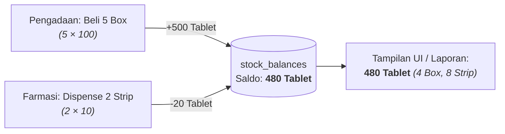

# Product Requirement Document (PRD): Catalog Item Domain

## 1. Ringkasan Eksekutif & Latar Belakang

Domain `internal/catalog/item` bertindak sebagai master katalog barang sentral di HOSIM-GO. Katalog ini melayani seluruh kebutuhan operasional rumah sakit, mulai dari pelayanan klinis (Farmasi, Rawat Jalan, Rawat Inap, IGD), logistik & persediaan (Gudang Medis, Gudang Non-Medis, Depo), pengadaan (Procurement), hingga penagihan dan akuntansi (Billing & Finance).

Sebelumnya, pencatatan item rumah sakit berisiko tercampur atau tidak memiliki atribut yang presisi sesuai karakteristik fungsionalnya. Oleh karena itu, katalog item dirancang menggunakan pola **Shared Base Table (Class Table Inheritance)** yang memisahkan identitas umum barang dari atribut spesifik masing-masing subtipe:
1. **`item_medications`**: Obat-obatan, infus, dan vaksin dengan atribut dosis, bentuk sediaan, regulasi farmasi, dan integrasi SATUSEHAT KFA.
2. **`item_generals`**: Bahan Medis Habis Pakai (BMHP), instrumen medis/linen steril (siklus CSSD), dan barang umum/logistik non-medis (ATK, kebersihan, gizi).
3. **`item_assets`**: Barang modal dan alat kesehatan yang memiliki umur ekonomis, penyusutan (depresiasi), dan jadwal pemeliharaan/kalibrasi.

Selain pemisahan subtipe fisik, katalog ini mengintegrasikan **Akuntansi Persediaan dan Pendapatan** secara modular:
- **`item_categories`**: Memetakan kelompok barang ke **COA Pendapatan (Revenue Account)** pada modul billing.
- **`item_product_lines`**: Memetakan kelompok persediaan ke **COA Persediaan (Inventory Asset Account)** dan **COA Beban/HPP (COGS Account)** pada modul akuntansi/logistik.

---

## 2. Arsitektur Data & Model Relasional

### 2.1 Pola Inheritance: Shared Base Table

Setiap barang tercatat pada tabel induk universal `items`. Modul `inventory` (kartu stok, batch/lot, mutasi), `billing` (tarif, invoice), dan `procurement` (purchase order) cukup mereferensikan satu foreign key universal: `item_id`.

```mermaid
erDiagram
    ITEM_CATEGORIES ||--o{ ITEMS : "mapping COA pendapatan"
    ITEM_PRODUCT_LINES ||--o{ ITEMS : "mapping COA persediaan & HPP"
    ITEMS ||--|| ITEM_MEDICATIONS : "1:1 subtype obat"
    ITEMS ||--|| ITEM_GENERALS : "1:1 subtype umum / BMHP"
    ITEMS ||--|| ITEM_ASSETS : "1:1 subtype aset modal"
    ITEMS ||--o{ ITEM_UNITS : "1:N multi-satuan (UOM)"

    ITEMS {
        uuid id PK
        string code UK "SKU / Barcode unik"
        string name "Nama resmi produk"
        string generic_name "Nama generik / zat aktif"
        enum item_type "MEDICATION | GENERAL | ASSET"
        uuid category_id FK "Relasi ke item_categories (COA Pendapatan)"
        uuid product_line_id FK "Relasi ke item_product_lines (COA Persediaan & HPP)"
        boolean is_active "Status aktif katalog"
    }

    ITEM_MEDICATIONS {
        uuid item_id PK_FK
        string kfa_code "Kode KFA Kemenkes SATUSEHAT"
        string bpom_nie "Nomor Izin Edar BPOM"
        string dosage_form "Bentuk sediaan (Tablet, Sirup, Injeksi)"
        string strength_amount "Kekuatan dosis (500, 10, dll)"
        string strength_unit "Satuan kekuatan (mg, mcg, ml, %, dll)"
        string default_route "Rute pemberian (Oral, IV, IM, Topikal)"
        string medication_type "Bebas, Keras, Narkotika, Psikotropika, Prekursor"
        boolean is_high_alert "High Alert Medication (HAM)"
        boolean is_lasa "Look Alike Sound Alike (LASA / NORUM)"
        boolean is_fornas "Formularium Nasional"
        boolean is_antibiotic "Flag Antibiotik"
        string storage_temperature "Suhu simpan (Ruang, Kulkas 2-8C, Beku)"
    }

    ITEM_GENERALS {
        uuid item_id PK_FK
        string general_type "BMHP_MEDIS | INSTRUMEN_MEDIS | ATK | LINEN | KEBERSIHAN | DAPUR | LAINNYA"
        boolean is_sterile "Flag sterilitas produk akhir"
        boolean is_disposable "Single-use (true) vs Reusable (false)"
        boolean is_cssd_item "Apakah item ini dikelola dalam siklus sterilisasi CSSD"
        string sterilization_method "Metode sterilisasi: STEAM_AUTOCLAVE | EO_GAS | PLASMA | DRY_HEAT"
    }

    ITEM_ASSETS {
        uuid item_id PK_FK
        string brand "Merk / Brand manufaktur"
        string model_name "Tipe / Model mesin/alat"
        boolean is_medical_equipment "Alat medis vs Non-medis"
        int expected_life_years "Estimasi umur ekonomis (tahun)"
        string depreciation_method "Metode penyusutan (Straight Line, dsb)"
        int maintenance_interval_days "Interval servis / kalibrasi berkala (hari)"
    }

    ITEM_UNITS {
        uuid id PK
        uuid item_id FK
        string unit_name "Nama satuan (Box, Strip, Tablet, Pcs)"
        numeric conversion_factor "Rasio pengali ke base unit"
        boolean is_base_unit "Satuan terkecil (faktor = 1)"
        boolean is_purchase_unit "Satuan default saat PO"
        boolean is_dispense_unit "Satuan default saat resep/dispensing"
    }

    ITEM_CATEGORIES {
        uuid id PK
        string code UK "Kode Kategori"
        string name "Nama Kategori"
        string item_type "Filter subtipe item"
        string income_coa_code "Kode COA Akun Pendapatan"
        boolean is_active
    }

    ITEM_PRODUCT_LINES {
        uuid id PK
        string code UK "Kode Lini Produk"
        string name "Nama Lini Produk"
        string inventory_coa_code "Kode COA Akun Persediaan (Neraca/Aset)"
        string cogs_coa_code "Kode COA Akun Beban Pokok / HPP"
        boolean is_active
    }
```

---

## 3. Integrasi Akuntansi Finansial (Dual-COA Mapping)

Pemisahan antara `item_categories` dan `item_product_lines` menyelesaikan tantangan pemisahan akuntansi persediaan (Neraca) dan pendapatan (Laba Rugi):

| Entitas | Peran Akuntansi | Sisi Laporan | Trigger Transaksi |
|---|---|---|---|
| **`item_product_lines`** | **COA Persediaan** (`inventory_coa_code`) & **COA Beban/HPP** (`cogs_coa_code`) | **Neraca (Aset Lancar)** & **Laba Rugi (Beban Pokok)** | Saat penerimaan barang PO gudang (Debet: Persediaan), dan saat pemakaian/dispensing barang (Kredit: Persediaan, Debet: HPP). |
| **`item_categories`** | **COA Pendapatan** (`income_coa_code`) | **Laba Rugi (Pendapatan Operasional)** | Saat tagihan kasir/faktur pasien terbentuk pada modul Billing (Kredit: Pendapatan, Debet: Piutang/Kas). |

### Contoh Kasus Akuntansi:
1. **Obat Amoxicillin 500mg**:
   - `product_line`: "Persediaan Obat Paten & Generik" -> Akun Persediaan: `114.01.001`, Akun HPP: `510.01.001`.
   - `category`: "Pendapatan Farmasi Rawat Jalan" -> Akun Pendapatan: `410.02.001`.
2. **Kasa Steril 10x10 (BMHP)**:
   - `product_line`: "Persediaan BMHP Bedah" -> Akun Persediaan: `114.02.001`, Akun HPP: `510.02.001`.
   - `category`: "Pendapatan Tindakan Medis / Bahan Medis" -> Akun Pendapatan: `410.03.001`.

---

## 4. Multi-Satuan Ukur (Multi-UOM) & Konversi

Rumah sakit membutuhkan konversi multi-satuan fleksibel untuk alur suplai dari pengadaan hingga konsumsi pasien:
- **`is_base_unit` (Satuan Terkecil)**: Nilai acuan stok inventory di database. Faktor konversi selalu `1.0`. Contoh: *Tablet*, *Kapsul*, *Pcs*, *ml*.
- **`is_purchase_unit` (Satuan Pengadaan/Beli)**: Default saat membuat Purchase Requisition (PR) dan Purchase Order (PO). Contoh: *Box* (faktor = 100 Tablet), *Karton*, *Rim*.
- **`is_dispense_unit` (Satuan Pelayanan/Resep)**: Default saat peresepan dokter dan penyerahan obat di kasir/depo. Contoh: *Strip* (faktor = 10 Tablet), *Botol*, *Vial*.

### 4.1 Contoh Data Konversi Riil

| Kategori Item | Satuan | `conversion_factor` | `is_base_unit` | `is_purchase_unit` | `is_dispense_unit` | Keterangan Operasional |
|---|---|---|---|---|---|---|
| **Amoxicillin 500mg** | Tablet | 1 | `true` | `false` | `true` | Satuan stok dasar & eceran |
| | Strip | 10 | `false` | `false` | `true` | Satuan resep dokter lazim |
| | Box | 100 | `false` | `true` | `false` | Satuan beli kemasan distributor |
| **Paracetamol Sirup** | Botol | 1 | `true` | `false` | `true` | Satuan konsumsi eceran |
| | Karton | 24 | `false` | `true` | `false` | Satuan beli grosir |
| **Sarung Tangan Bedah** | Pasang | 1 | `true` | `false` | `true` | Satuan pemakaian tindakan |
| | Box | 50 | `false` | `false` | `false` | Distribusi depo ruang OK |
| | Karton | 500 | `false` | `true` | `false` | PO pengadaan logistik |

### 4.2 Alur Transaksi Stok Multi-UOM ke Modul Inventory



---

### 5.1 Kepatuhan Regulasi Farmasi & SATUSEHAT (`item_medications`)

1. **Integrasi KFA Kemenkes (SATUSEHAT)**:
   - Kolom `kfa_code` menyimpan kode identifikasi resmi dari Kamus Farmasi dan Alat Kesehatan Kemenkes RI untuk interoperabilitas RME (Rekam Medis Elektronik).
2. **Izin Edar BPOM**:
   - Kolom `bpom_nie` untuk mencatat validitas registrasi izin edar obat di Indonesia.
3. **Keselamatan Pasien (Patient Safety)**:
   - `is_high_alert`: Obat yang memerlukan kewaspadaan tinggi (misal: elektrolit konsentrat pekat, sitostatika).
   - `is_lasa`: Obat dengan nama, rupa, atau ucapan mirip (*Look-Alike Sound-Alike* / NORUM) untuk memicu label peringatan visual saat peresepan & dispensing.
   - `is_antibiotic`: Kontrol penggunaan antibiotik dan program resistensi antimikroba (PPRA).
4. **Regulasi Narkotika & Psikotropika**:
   - Klasifikasi ketat untuk pelaporan berkala SIPNAP (Sistem Pelaporan Narkotika dan Psikotropika).

### 5.2 Standarisasi Sterilisasi & Siklus CSSD (`item_generals`)

1. **Klasifikasi Barang CSSD vs Non-CSSD**:
   - Kolom `is_cssd_item = true` menandai bahwa peredaran fisik dan siklus pakai item menjadi wewenang instalasi CSSD.
   - Kolom `is_disposable = false` (reusable) dan `is_sterile = true` mengidentifikasi instrumen atau linen yang wajib diproses ulang (dekontaminasi $\rightarrow$ pencucian $\rightarrow$ pengemasan $\rightarrow$ sterilisasi $\rightarrow$ distribusi).
2. **Spesifikasi Mesin & Metode Sterilisasi (`sterilization_method`)**:
   - Menghindari kerusakan alat bedah atau instrumen medis berbahan sensitif panas dengan mencatat metode sterilisasi yang valid:
     - `STEAM_AUTOCLAVE`: Uap panas bertekanan (instrumen logam stainless, kain/linen).
     - `PLASMA`: Hidrogen peroksida suhu rendah (kamera laparoskopi, endoskopi, instrumen kabel/elektronik).
     - `EO_GAS`: Ethylene Oxide gas (alat medis plastik termolabil / sensitif panas).
     - `DRY_HEAT`: Panas kering (alat kaca/oil/serbuk tertentu).

---

## 6. Desain Endpoint API

### 6.1 Agregat & Universal Search (Untuk Modul Inventory, Billing, Procurement)
- `GET /api/v1/catalog/items`: Pencarian umum seluruh tipe item dengan filter `item_type`, `category_id`, `product_line_id`, `search` (kode/nama/barcode), pagination.
- `GET /api/v1/catalog/items/:id`: Detail lengkap item beserta ekstensi subtipe (`medication`, `general`, `asset`) dan daftar `units`.

### 6.2 Pengelolaan Khusus Subtipe (Input Form Terpisah & Validasi Ketat)
- **Obat**:
  - `POST /api/v1/catalog/items/medications`: Mendaftarkan item baru bertipe medication beserta field dosis & regulasi.
  - `PUT /api/v1/catalog/items/medications/:id`: Memperbarui data umum dan atribut obat.
- **Barang Umum / BMHP**:
  - `POST /api/v1/catalog/items/generals`: Mendaftarkan item umum / BMHP.
  - `PUT /api/v1/catalog/items/generals/:id`: Memperbarui data umum dan atribut general.
- **Aset / Alkes Modal**:
  - `POST /api/v1/catalog/items/assets`: Mendaftarkan master tipe aset (spesifikasi, masa manfaat, metode depresiasi).
  - `PUT /api/v1/catalog/items/assets/:id`: Memperbarui master tipe aset.

### 6.3 Pengelolaan Satuan & Akuntansi
- `POST /api/v1/catalog/items/:id/units`: Menambah satuan alternatif & rasio konversi.
- `PUT /api/v1/catalog/items/:id/units/:unit_id`: Mengubah konfigurasi satuan atau rasio konversi.
- `DELETE /api/v1/catalog/items/:id/units/:unit_id`: Menghapus satuan alternatif (selama bukan base unit).
- `CRUD /api/v1/catalog/item-categories`: Pengelolaan master kategori & mapping COA Pendapatan.
- `CRUD /api/v1/catalog/item-product-lines`: Pengelolaan master lini produk & mapping COA Persediaan/HPP.

---

## 7. Rencana Kerja Implementasi (Roadmap)

1. **Database Migration (Goose)**:
   - Buat migrasi `migrations/00007_create_master_item_tables.sql` mencakup tabel `item_categories`, `item_product_lines`, `items`, `item_medications`, `item_generals`, `item_assets`, `item_units`.
2. **Domain Entities & Enums**:
   - `pkg/enums/item.go`: Enum tipe item, general type, medication type, depreciation method.
   - `internal/catalog/item/entity.go`: Struct domain GORM dengan audit trail dan UUID v7.
3. **Repository Layer**:
   - `internal/catalog/item/repository.go`: Query teroptimasi, eager-loading subtype, filter pagination.
4. **Service & Validation Layer (Jalur A Clean Architecture)**:
   - `internal/catalog/item/service.go`: Validasi integritas base unit, kode unik, dan transaksi atomik pembuatan base + subtype.
5. **Transport Layer (Gin HTTP Handler & DTO)**:
   - `internal/catalog/item/dto.go`: Request dan response DTO terpisah dari model entity.
   - `internal/catalog/item/handler.go`: Handler endpoint universal dan subtipe.
6. **Testing & Database Seeder**:
   - `internal/catalog/item/service_test.go`: Unit test bisnis logic & konversi satuan.
   - `internal/catalog/item/seeder.go`: Sampel awal kategori, lini produk, obat KFA, BMHP, dan aset.
