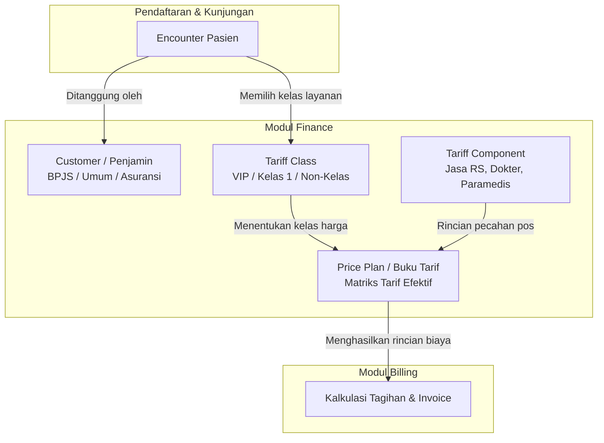

# Modul Finance (Keuangan & Tarif Rumah Sakit)

Dokumentasi arsitektur dan bisnis modul `finance` di HOSIM-GO.

---

## 1. 🎯 Peran & Batasan Modul (Module Boundary)

Sesuai [AGENTS.md § 11](file:///c:/laragon/www/hosim-go/AGENTS.md), modul `finance` bertanggung jawab atas **master data keuangan dan penentuan kebijakan tarif** rumah sakit:
- **Payer / Customer**: Penjamin pembayaran pasien (Umum/Personal, BPJS Kesehatan, Asuransi Swasta, Korporat).
- **Tariff Class**: Kelas layanan tarif (VVIP, VIP, Kelas I, II, III, Non-Kelas).
- **Tariff Component**: Pos alokasi pecahan tarif (Jasa RS/Sarana, Jasa Medis Dokter, Jasa Paramedis).
- **Price Plan (Buku Tarif)**: Kebijakan dan matriks nominal tarif berdasarkan layanan, kelas tarif, dan masa berlaku.

Modul ini menyediakan referensi finansial yang nantinya diorkestrasi oleh modul **Billing / Kasir** saat menghitung total tagihan kunjungan (*encounter*).

---

## 2. 🧩 Sub-Modul dalam `internal/finance`

```text
internal/finance/
├── customer/            # Master Penjamin / Payer (BPJS, Asuransi, Korporat, Umum)
├── tariffclass/         # Master Kelas Tarif (VIP, Kelas 1, 2, 3, Non-Kelas)
├── tariffcomponent/     # Master Komponen Tarif (Jasa RS, Jasa Dokter, Paramedis)
└── priceplan/           # Kebijakan Buku Tarif & Matriks Harga Layanan
```

| Sub-Modul | Deskripsi | Jalur Arsitektur |
|---|---|---|
| [`customer`](customer/README.md) | Data penjamin bayar dan tipe customer | Jalur A (Master Data) |
| [`tariffclass`](tariffclass/README.md) | Kategori kelas tarif untuk akomodasi dan tindakan | Jalur A (Master Data) |
| [`tariffcomponent`](tariffcomponent/README.md) | Pos pembagian pendapatan (*revenue split*) | Jalur A (Master Data) |
| [`priceplan`](priceplan/PRD.md) | Buku tarif layanan, matriks harga per kelas, dan riwayat revisi | Jalur B (Business Workflow) |

---

## 3. 📊 Konsep Alur Penentuan Tarif



---

## 4. 🛡️ Aturan Bisnis & Integritas Data

1. **Pemisahan Penjamin vs Kelas Layanan**:
   - `Customer` menentukan **siapa** yang menanggung pembayaran.
   - `TariffClass` menentukan **acuan kelas biaya** yang digunakan.
2. **Audit & Ketertelusuran**:
   - Seluruh mutasi master data mencatat `created_by`, `updated_by`, dan `deleted_by`.
   - Modifikasi tarif aktif memerlukan riwayat versi (*effective dates*) agar tagihan historis tidak berubah.
3. **Soft Delete**:
   - Data referensi yang sudah digunakan dalam transaksi tagihan atau rekam medis aktif dilarang dihapus secara permanen (*hard delete*).
