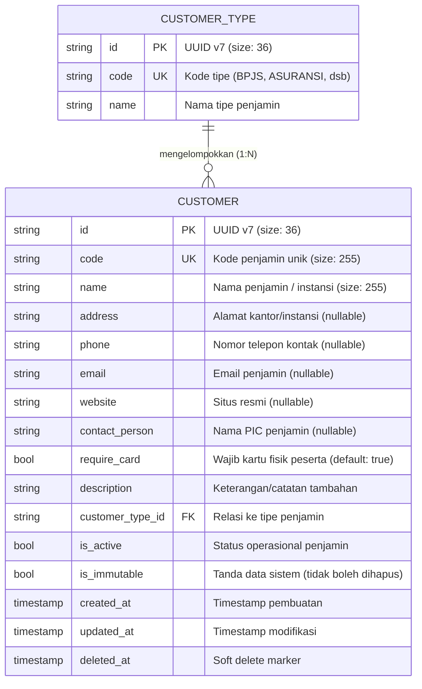

# Customer ( Penjamin Bayar )

Dokumentasi ini ditujukan bagi kontributor (developer dan AI agent) agar memahami konteks bisnis, integritas data, dan aturan operasional entitas `Customer` (Penjamin Bayar) di HOSIM-GO.

## 1. Gambaran dan Definisi

Dalam konteks manajemen rumah sakit, `Customer` mengacu pada **entitas penjamin pembayaran** yang mewakili entitas legal atau korporat yang bertanggung jawab atas pembiayaan layanan pasien. Entitas ini berfungsi sebagai "tuan rumah" (*parent entity*) yang menaungi pasien, klaim asuransi, serta kontrak layanan medis yang disepakati.

> Tipe Customer
>> 1. Personal ( pasien individual / umum )
>> 2. Corporate ( perusahaan / instansi )
>> 3. BPJS ( Badan Penyelenggara Jaminan Sosial )
>> 4. Insurance ( Asuransi ) 
>> 5. Internal ( untuk karyawan rumah sakit biasanya ada benefit tersendiri )

## 2. 🛡️ Invariant & Aturan Bisnis (Non-Negotiable)
1. **Imutability** untuk customer dengan tipe personal itu sudah pasti harus ada. tidak boleh di update 
2. **Untuk customer tipe BPJS** itu tidak boleh di hapus, hanya bisa di nonaktifkan
3. **Untuk customer tipe Corporate dan Insurance** itu boleh di hapus atau di nonaktifkan, karena biasanya data ini akan di update seiring waktu

## 3. Relasi dan Kardinalitas Data



---

## 4. 📂 Peta File Sumber Daya (Code Tour)

- [`entity.go`](entity.go): Definisi struct entitas `Customer` dan `CustomerType`, GORM tag, relasi, dan hook `BeforeCreate` UUID v7.
- [`repository.go`](repository.go): Implementasi query database GORM (`Create`, `Update`, `Delete`, `FindByID`, `FindByCode`, `FindAll`, `FindAllCustomerTypes`).
- [`service.go`](service.go): Aturan bisnis, validasi email/kode/nama, perlindungan status `is_immutable`, dan normalisasi string.
- [`handler.go`](handler.go): Transport layer Gin HTTP handler untuk endpoint REST API penjamin dan tipe customer.
- [`doc.go`](doc.go): Dokumentasi package Go.

---

## 5. 🌐 Kontrak REST API

Base Path: `/api/v1` (Terproteksi JWT)

| Method | Endpoint | Permission | Deskripsi |
|---|---|---|---|
| `GET` | `/customer-types` | `customer:read` | Ambil referensi seluruh tipe customer |
| `GET` | `/customers` | `customer:read` | List data penjamin (paginasi & pencarian) |
| `POST` | `/customers` | `customer:create` | Tambah customer/penjamin baru |
| `GET` | `/customers/:id` | `customer:read` | Detail customer/penjamin berdasarkan ID |
| `PUT` | `/customers/:id` | `customer:update` | Ubah data customer/penjamin |
| `DELETE` | `/customers/:id` | `customer:delete` | Soft delete customer (kecuali `is_immutable=true`) |

### Contoh Request Body (`POST /customers`)
```json
{
  "code": "CUST-ASR-PRUD",
  "name": "PT Prudential Life Assurance",
  "address": "Prudential Tower, Jl. Jend. Sudirman Kav. 79, Jakarta",
  "phone": "021-29958888",
  "email": "corporate.claim@prudential.co.id",
  "contact_person": "Budi Santoso (Head of Claims)",
  "require_card": true,
  "description": "Penjamin Asuransi Kesehatan Korporat",
  "customer_type_id": "01923e42-1234-7000-8000-000000000001",
  "is_active": true,
  "is_immutable": false
}
```

