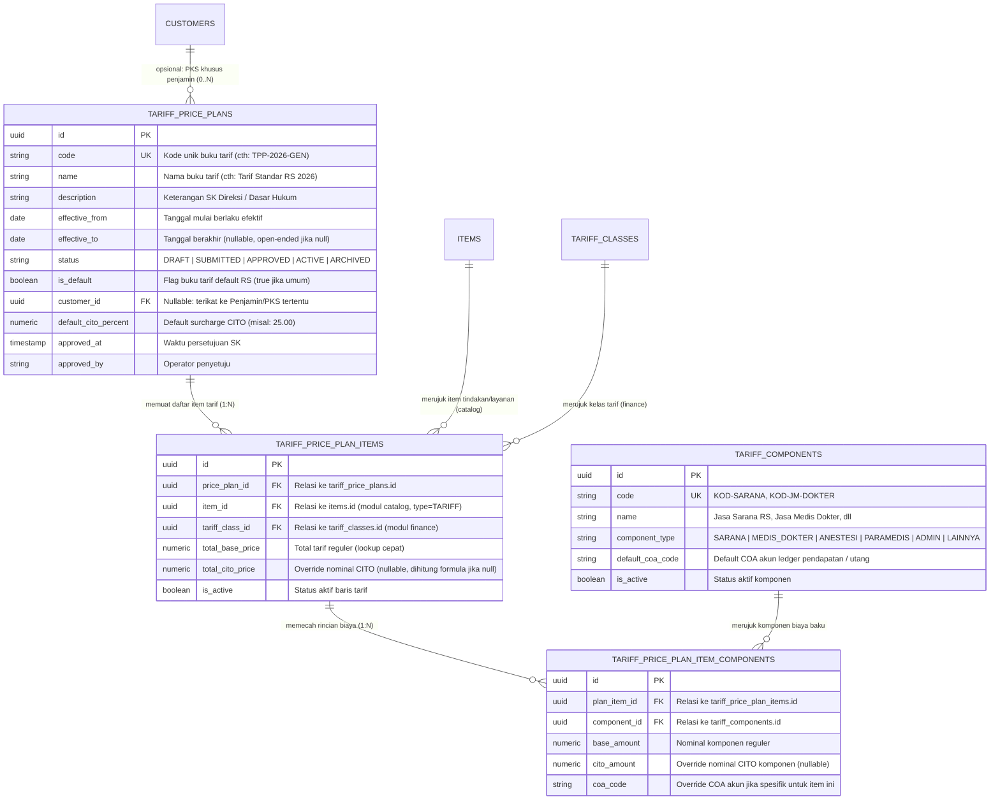
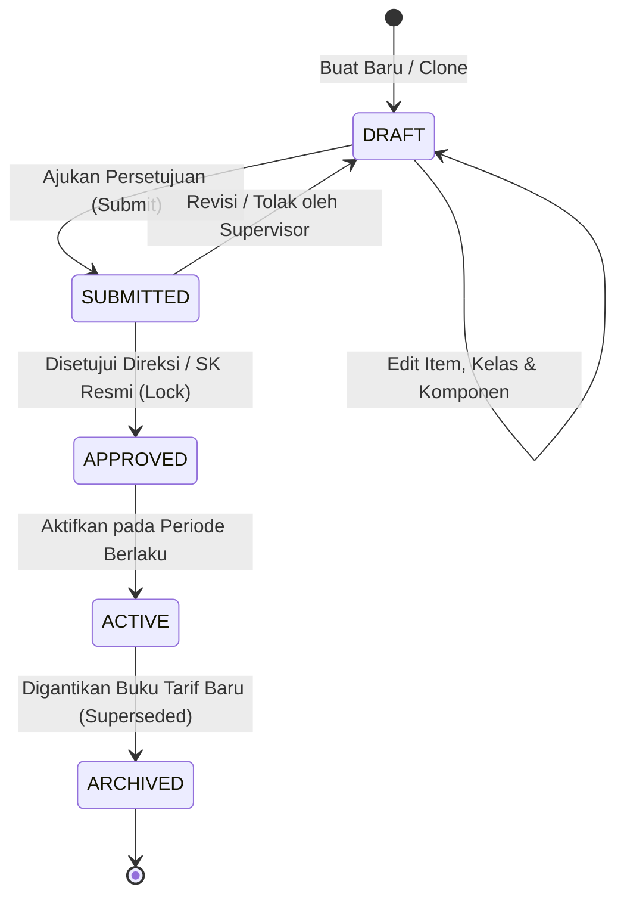

# Product Requirement Document (PRD): Tariff Price Plan Domain (Buku Tarif Rumah Sakit)

## 1. Ringkasan Eksekutif & Latar Belakang

Domain `internal/finance/priceplan` bertindak sebagai **pusat kebijakan tarif (*Tariff Policy & Pricing Engine*)** di HOSIM-GO. Domain ini bertanggung jawab mengatur struktur harga seluruh layanan medis, tindakan operatif, pemeriksaan penunjang, akomodasi rawat inap, dan beban administrasi rumah sakit.

### 1.1 Masalah Operasional yang Diselesaikan
Dalam operasional rumah sakit modern, pengelolaan tarif menghadapi kompleksitas tinggi:
1. **Perubahan Tarif Berkala & Audit Trail Legalitas**: Tarif rumah sakit berubah secara berkala berdasarkan Surat Keputusan (SK) Direksi / Regulasi Daerah. Perubahan tarif masa kini **dilarang merusak riwayat transaksi penagihan masa lalu** (*historical billing integrity*).
2. **Multi-Tarif Berdasarkan Penjamin (PKS Rekanan)**: Pasien umum, asuransi swasta komersial, perusahaan rekanan, dan BPJS seringkali memiliki kesepakatan harga atau plafon penagihan yang berbeda (buku tarif khusus).
3. **Diferensiasi Kelas Rawat Pasien**: Tindakan medis yang sama memiliki besaran tarif yang berbeda tergantung pada kelas perawatan pasien (`tariff_classes`: VVIP, VIP, Kelas I, II, III, Non-Kelas/KRIS).
4. **Pecahan Komponen Biaya & Remunerasi Medis**: Setiap tagihan tindakan medis bukan sekadar nominal bulat, melainkan gabungan dari **Jasa Sarana RS** (kamar, sewa alat, BMHP) dan **Jasa Pelayanan/Medis** (honor dokter operator, dokter anestesi, paramedis) untuk otomasi pembagian jasa (*fee-sharing*) dan penjurnalan buku besar akuntansi (*GL Ledger*).
5. **Penanganan Kasus CITO (Emergensi/Cepat)**: Tindakan darurat di luar jam kerja atau saat kegawatan memerlukan kenaikan tarif (*surcharge CITO*) baik secara formula persentase standar maupun penetapan nominal khusus.

### 1.2 Batas Kewenangan Modul (Separation of Concerns)
Sesuai prinsip arsitektur di [`AGENTS.md`](file:///c:/laragon/www/hosim-go/AGENTS.md):
- **Modul `catalog`** ([`internal/catalog/item/PRD.md`](file:///c:/laragon/www/hosim-go/internal/catalog/item/PRD.md)): Bertindak sebagai master definisi layanan medis universal (`items` bertipe `TARIFF` dengan subtipe `item_tariffs` seperti `charge_type: ADMINISTRASI | AKOMODASI | TINDAKAN | PENUNJANG | LAINNYA`). Modul catalog **tidak menyimpan nominal harga kaku**.
- **Modul `finance/priceplan`**: Mengontrol nominal harga, versioning buku tarif, relasi kelas rawat, pecahan komponen biaya, aturan CITO, dan resolusi lookup tarif bagi modul operasional (*Billing*, *Outpatient*, *Inpatient*, *Emergency*).

---

## 2. Arsitektur Data & Model Relasional



---

## 3. Spesifikasi Entitas & Tabel Database

### 3.1 `tariff_components` (Master Komponen Biaya Baku)
Menyimpan referensi baku jenis komponen biaya yang membentuk suatu tarif tindakan/layanan di rumah sakit.
- **`id`**: UUID v7 (Primary Key).
- **`code`**: Kode komponen unik (misal: `SARANA_RS`, `JM_DOKTER_OPERATOR`, `JM_DOKTER_ANESTESI`, `PARAMEDIS`, `ADMIN_LOKET`).
- **`name`**: Label resmi komponen (misal: "Jasa Sarana Rumah Sakit", "Jasa Medis Dokter Spesialis").
- **`component_type`**: Enum kategori (`SARANA`, `MEDIS_DOKTER`, `ANESTESI`, `PARAMEDIS`, `ADMIN`, `LAINNYA`).
- **`default_coa_code`**: Akun Chart of Accounts standar untuk komponen ini (misal akun pendapatan `410.01.xxx` untuk sarana RS, atau akun liabilitas `214.01.xxx` untuk utang jasa dokter).
- **`is_active`**: Status aktif (`true`/`false`).

### 3.2 `tariff_price_plans` (Header Buku Tarif)
Header pengendali yang membawahi satu bundle ketetapan tarif resmi pada periode tertentu.
- **`id`**: UUID v7 (Primary Key).
- **`code`**: Kode unik buku tarif (misal: `TPP-2026-REGULER`, `TPP-2026-INHEALTH`).
- **`name`**: Nama buku tarif (misal: "Buku Tarif Pelayanan RS Tahun 2026").
- **`description`**: Keterangan nomor SK Direksi, latar belakang penyesuaian, atau klausul PKS.
- **`effective_from`**: Tanggal mulai berlakunya tarif (*inclusive*).
- **`effective_to`**: Tanggal kedaluwarsa tarif (*nullable*). Jika bernilai `NULL`, tarif berlaku hingga ada buku tarif baru yang menggantikannya.
- **`status`**: Lifecycle approval status (`DRAFT`, `SUBMITTED`, `APPROVED`, `ACTIVE`, `ARCHIVED`).
- **`is_default`**: Boolean. Hanya boleh ada **satu** buku tarif default yang berstatus `ACTIVE` pada rentang tanggal yang sama. Digunakan sebagai acuan umum pasien Non-PKS/Pribadi.
- **`customer_id`**: UUID (*nullable*). Foreign key ke `customers` (modul finance). Terisi jika buku tarif ini adalah tarif khusus hasil negosiasi PKS dengan asuransi/korporat tertentu.
- **`default_cito_percent`**: Numeric(5,2). Default persentase kenaikan CITO (misal: `25.00` untuk markup +25%).
- **Audit & Approval**: `approved_at`, `approved_by`, `created_at`, `updated_at`, `created_by`, `updated_by`.

### 3.3 `tariff_price_plan_items` (Header Tarif Tindakan per Kelas)
Representasi tarif suatu item layanan pada kelas rawat tertentu di dalam buku tarif.
- **`id`**: UUID v7 (Primary Key).
- **`price_plan_id`**: FK ke `tariff_price_plans.id`.
- **`item_id`**: FK ke `items.id` (dari modul `catalog`, dipastikan `item_type = 'TARIFF'`).
- **`tariff_class_id`**: FK ke `tariff_classes.id` (dari modul `finance`).
- **`total_base_price`**: Numeric(15,2). Total harga tarif standar untuk tindakan dan kelas tersebut. Disimpan di tingkat header untuk query lookup cepat tanpa agregasi kalkulasi.
- **`total_cito_price`**: Numeric(15,2) (*nullable*). Nominal tarif darurat/CITO jika ditetapkan secara nominal kaku. Jika `NULL`, tarif CITO dihitung otomatis dari `default_cito_percent`.
- **`is_active`**: Status aktif item dalam buku tarif.
- **Index Keunikan**: `UNIQUE(price_plan_id, item_id, tariff_class_id)`.

### 3.4 `tariff_price_plan_item_components` (Rincian Komponen Biaya)
Rincian pemecahan biaya dari `total_base_price` yang digunakan saat proses billing dan penjurnalan keuangan.
- **`id`**: UUID v7 (Primary Key).
- **`plan_item_id`**: FK ke `tariff_price_plan_items.id` (*cascade delete* saat DRAFT).
- **`component_id`**: FK ke `tariff_components.id`.
- **`base_amount`**: Numeric(15,2). Porsi nominal biaya reguler untuk komponen ini.
- **`cito_amount`**: Numeric(15,2) (*nullable*). Porsi nominal biaya CITO jika komponen ini memiliki override nominal CITO tersendiri.
- **`coa_code`**: Varchar(50) (*nullable*). Override akun COA jika item tindakan ini memiliki akun akuntansi yang berbeda dari `default_coa_code` milik master komponen.

---

## 4. 🛡️ Invariant & Aturan Bisnis (Non-Negotiable)

### 4.1 Immutability Buku Tarif Aktif / Disetujui
- Buku tarif yang telah mencapai status `APPROVED` atau `ACTIVE` bersifat **terkunci permanen (Immutable)**.
- Dilarang keras melakukan update nilai harga (`total_base_price`, `base_amount`), penambahan item, maupun penghapusan item pada buku tarif yang aktif/disetujui.
- **Alur Perubahan Tarif**: Jika terjadi penyesuaian tarif rumah sakit (kenaikan harga tahunan), operator finance **wajib membuat buku tarif baru** (tersedia fitur *Clone from Existing Plan*) dengan nomor SK baru dan menetapkan `effective_from` yang baru.

### 4.2 Validasi Keseimbangan Komponen Biaya (*Component Balancing*)
- Sebelum status buku tarif dapat diajukan ke `APPROVED` atau `ACTIVE`, sistem memvalidasi bahwa untuk setiap baris `tariff_price_plan_items`:
  $$\sum \text{base\_amount} = \text{total\_base\_price}$$
- Jika terdapat selisih nominal (komponen tidak seimbang dengan total harga header), use case persetujuan akan menolak dengan error `ErrTariffComponentsMismatch`.

### 4.3 Resolusi Tarif CITO (Hybrid Mechanism)
Saat modul klinis atau kasir memproses tindakan dengan indikasi cito (`is_cito = true`):
1. Sistem mengecek kolom `total_cito_price` pada `tariff_price_plan_items`.
2. Jika terisi nominal eksplisit, gunakan nilai `total_cito_price` tersebut.
3. Jika bernilai `NULL`, sistem menghitung secara dinamis:
   $$\text{Final Cito Price} = \text{total\_base\_price} \times \left(1 + \frac{\text{default\_cito\_percent}}{100}\right)$$
4. Untuk pecahan komponen biaya saat cito:
   - Jika `cito_amount` terisi pada komponen, gunakan nilai tersebut.
   - Jika `NULL`, naikkan masing-masing `base_amount` dengan persentase `default_cito_percent`.

### 4.4 Resolusi & Fallback Hierarkis (*Lookup Engine*)
Saat modul *Billing* atau *Order Tindakan Klinis* meminta tarif untuk pasien dengan parameter:
`LookupTariff(customer_id, tariff_class_id, item_id, transaction_date, is_cito)`

Algoritma resolusi tarif wajib berjalan dengan urutan berikut:
1. **Langkah 1 (Cek Custom Plan Penjamin)**:
   - Cari buku tarif berstatus `ACTIVE` yang memiliki `customer_id` sesuai penjamin pasien dan mencakup `transaction_date` (`effective_from <= date` dan `effective_to IS NULL OR effective_to >= date`).
   - Jika ditemukan, cari item pada plan tersebut untuk `(item_id, tariff_class_id)`.
   - Jika item ditemukan, gunakan tarif dari custom plan ini.
2. **Langkah 2 (Fallback ke General/Standard Plan)**:
   - Jika pasien tidak memiliki custom plan, ATAU item tindakan tidak ditemukan di dalam custom plan penjamin:
   - Cari buku tarif standar RS (`is_default = true`, status `ACTIVE`) yang mencakup `transaction_date`.
   - Ambil tarif untuk `(item_id, tariff_class_id)`.
3. **Langkah 3 (Not Found Error)**:
   - Jika pada buku tarif standar pun tindakan tersebut tidak terdaftar untuk kelas tarif terkait, kembalikan sentinel error `ErrTariffNotConfigured` agar staf kasir/administrasi dapat mengonfirmasi konfigurasi tarif.

---

## 5. 🔄 Lifecycle & State Transitions

Pengelolaan siklus buku tarif mengikuti **Jalur B (Business Transaction)** pada [`AGENTS.md`](file:///c:/laragon/www/hosim-go/AGENTS.md):



| Status | Deskripsi Operasional | Data Boleh Diubah? | Boleh Dipakai Lookup Kasir? |
|---|---|:---:|:---:|
| `DRAFT` | Sedang dirancang oleh staf finance; harga dan komponen masih tentatif | ✅ Ya | ❌ Tidak |
| `SUBMITTED` | Telah diajukan untuk verifikasi manajer finance / tim tarif | ❌ Tidak | ❌ Tidak |
| `APPROVED` | Disetujui secara resmi dengan nomor SK; terkunci permanen | ❌ Tidak (Immutable) | ❌ Belum (Menunggu `ACTIVE`) |
| `ACTIVE` | Buku tarif operasional yang sedang berjalan saat ini | ❌ Tidak (Immutable) | ✅ Ya |
| `ARCHIVED` | Buku tarif lampau yang sudah digantikan versi baru | ❌ Tidak (Immutable) | ❌ Tidak (Hanya histori) |

---

## 6. Desain Endpoint API

### 6.1 Pengelolaan Master Komponen Biaya (Jalur A - Simple Master Data)
- `GET /api/v1/finance/tariff-components`: Menampilkan daftar komponen biaya dengan filter pencarian dan tipe.
- `POST /api/v1/finance/tariff-components`: Mendaftarkan komponen biaya baku baru.
- `GET /api/v1/finance/tariff-components/:id`: Detail komponen biaya.
- `PUT /api/v1/finance/tariff-components/:id`: Memperbarui nama, tipe, atau default COA komponen.
- `DELETE /api/v1/finance/tariff-components/:id`: Menonaktifkan komponen biaya.

### 6.2 Pengelolaan Buku Tarif / Price Plan (Jalur B - Application Use Cases)
- `GET /api/v1/finance/price-plans`: Daftar buku tarif (filter: status, customer_id, default, pagination).
- `POST /api/v1/finance/price-plans`: Membuat buku tarif baru (status awal `DRAFT`).
- `GET /api/v1/finance/price-plans/:id`: Detail buku tarif beserta ringkasan item & statistik kelas.
- `PUT /api/v1/finance/price-plans/:id`: Memperbarui metadata buku tarif (hanya jika `DRAFT`).
- `POST /api/v1/finance/price-plans/:id/clone`: **Kloning buku tarif**. Menyalin seluruh daftar item dan rincian komponen dari buku tarif acuan ke buku tarif baru berstatus `DRAFT` untuk efisiensi penetapan tarif tahunan.
- `POST /api/v1/finance/price-plans/:id/submit`: Mengajukan buku tarif untuk persetujuan.
- `POST /api/v1/finance/price-plans/:id/approve`: Menyetujui buku tarif (mengunci data dan memverifikasi balancing komponen).
- `POST /api/v1/finance/price-plans/:id/activate`: Mengaktifkan buku tarif menjadi rujukan operasional.
- `POST /api/v1/finance/price-plans/:id/archive`: Mengarsipkan buku tarif.

### 6.3 Pengelolaan Item Tarif & Komponen di Dalam Buku Tarif (Hanya Status `DRAFT`)
- `GET /api/v1/finance/price-plans/:id/items`: Daftar item tarif dalam plan (filter: `tariff_class_id`, pencarian nama item, pagination).
- `POST /api/v1/finance/price-plans/:id/items`: Menambahkan satu atau beberapa item tarif beserta rincian komponennya.
- `PUT /api/v1/finance/price-plans/:id/items/:item_id`: Memperbarui nominal total dan rincian komponen item terkait.
- `DELETE /api/v1/finance/price-plans/:id/items/:item_id`: Menghapus item dari buku tarif.
- `POST /api/v1/finance/price-plans/:id/items/batch-upsert`: Bulk update tarif via import JSON/Excel.

### 6.4 Core Engine Lookup Tarif (Internal & Public Query Port)
- `POST /api/v1/finance/price-plans/lookup`: Engine pencarian tarif untuk kasir/billing/klinis:
  - **Request Body**:
    ```json
    {
      "customer_id": "018e3a24-...",
      "tariff_class_id": "018e3a10-...",
      "item_id": "018e3a55-...",
      "transaction_date": "2026-09-27T10:00:00Z",
      "is_cito": false
    }
    ```
  - **Response Body**:
    ```json
    {
      "success": true,
      "data": {
        "price_plan_id": "018e3a80-...",
        "price_plan_code": "TPP-2026-REGULER",
        "is_custom_plan": false,
        "item_id": "018e3a55-...",
        "tariff_class_id": "018e3a10-...",
        "is_cito": false,
        "total_price": 250000.00,
        "components": [
          {
            "component_id": "018e3a01-...",
            "component_name": "Jasa Sarana RS",
            "component_type": "SARANA",
            "amount": 75000.00,
            "coa_code": "410.01.001"
          },
          {
            "component_id": "018e3a02-...",
            "component_name": "Jasa Medis Dokter Spesialis",
            "component_type": "MEDIS_DOKTER",
            "amount": 175000.00,
            "coa_code": "214.01.001"
          }
        ]
      }
    }
    ```

---

## 7. Rencana Kerja Implementasi (Roadmap)

1. **Database Migration (Goose)**:
   - Buat migrasi SQL Goose:
     - Tabel `tariff_components`
     - Tabel `tariff_price_plans` (dengan indeks tanggal, status, customer_id)
     - Tabel `tariff_price_plan_items` (dengan unique constraint plan_id + item_id + class_id)
     - Tabel `tariff_price_plan_item_components`
2. **Master Komponen Tarif (`internal/finance/tariffcomponent`)**:
   - Implementasi Jalur A: Entity, Repository, Service CRUD, dan Gin Handler.
3. **Price Plan Domain & Entities (`internal/finance/priceplan`)**:
   - Struct entity, status enum (`DRAFT`, `SUBMITTED`, `APPROVED`, `ACTIVE`, `ARCHIVED`), validasi business invariant, hook UUID v7.
4. **Use Case Orchestrators (Jalur B)**:
   - `create_price_plan.go`
   - `clone_price_plan.go`
   - `submit_price_plan.go`
   - `approve_price_plan.go`
   - `activate_price_plan.go`
   - `lookup_tariff.go` (Engine resolusi bertingkat + CITO).
5. **Transport Layer & Router Registration**:
   - DTO request/response, Gin Handlers, dan registrasi RBAC permission ke router API.
6. **Integration & Automated Testing**:
   - Unit test formula CITO dan validasi balancing komponen.
   - Integration test fallback hierarkis (Custom Plan -> General Plan -> Error).
