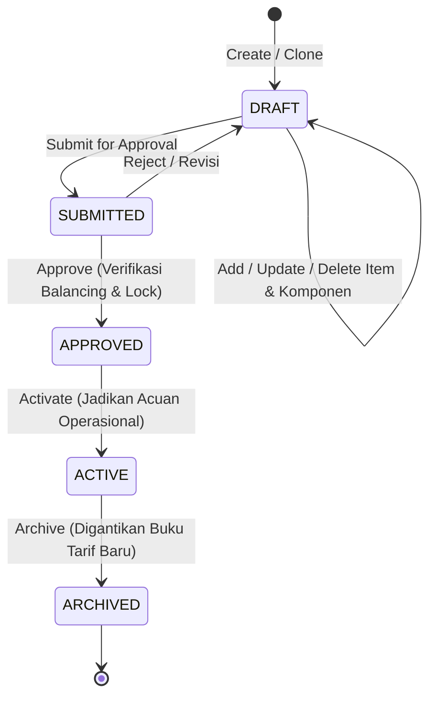

# Tariff Price Plan & Lookup Engine (Buku Tarif Rumah Sakit)

Dokumentasi ini ditujukan bagi kontributor (developer dan AI agent) agar memahami arsitektur, invariant bisnis, dan aturan operasional modul `priceplan` di HOSIM-GO sesuai [`PRD.md`](PRD.md).

---

## 1. 🎯 Gambaran & Konteks Bisnis

Sub-modul `internal/finance/priceplan` bertindak sebagai **pusat kebijakan tarif (*Tariff Policy & Pricing Engine*)** di HOSIM-GO. Modul ini bertanggung jawab atas:
1. **Header Buku Tarif (`tariff_price_plans`)**: Menampung Surat Keputusan (SK) Direksi / Regulasi Tarif resmi dengan periode berlaku (`effective_from`, `effective_to`), status persetujuan, persentase CITO standar, dan kaitan dengan penjamin/PKS rekanan.
2. **Item Tarif per Kelas (`tariff_price_plan_items`)**: Matriks harga dasar per kombinasi item tindakan medis katalog (`items` bertipe `TARIFF`) dan kelas layanan rawat (`tariff_classes`).
3. **Pecahan Komponen Biaya (`tariff_price_plan_item_components`)**: Pemecahan biaya ke pos Jasa Sarana RS, Jasa Medis Dokter, Anestesi, Paramedis, dan Administrasi beserta COA akuntansi.
4. **Tariff Lookup Engine**: Resolusi pencarian tarif bertingkat dan perhitungan CITO untuk billing, kasir, dan order klinis.

---

## 2. 🛡️ Invariant & Aturan Bisnis (Non-Negotiable)

1. **Jalur Arsitektur (Jalur B - Business Transaction)**:
   - Pengelolaan buku tarif melibatkan workflow state machine dan multi-entity write yang atomik.
2. **Immutability Buku Tarif**:
   - Buku tarif yang berstatus `SUBMITTED`, `APPROVED`, `ACTIVE`, atau `ARCHIVED` bersifat terkunci permanen (*Immutable*).
   - Penambahan, pengubahan, atau penghapusan item dan komponen biaya **hanya diizinkan pada status `DRAFT`**.
   - Perubahan tarif tahunan dilakukan melalui alur **Clone Plan**.
3. **Component Balancing Verification**:
   - Sebelum buku tarif dapat disetujui (`APPROVED`), seluruh item wajib divalidasi:
     $$\sum \text{base\_amount} = \text{total\_base\_price}$$
   - Jika terdapat ketidakseimbangan komponen, use case approval menolak dengan error `ErrTariffComponentsMismatch`.
4. **Resolusi Hierarkis Lookup Tarif (3 Langkah)**:
   - **Langkah 1**: Cek buku tarif aktif khusus penjamin pasien (`customer_id`). Jika ditemukan item untuk `(item_id, tariff_class_id)`, gunakan tarif ini (`is_custom_plan = true`).
   - **Langkah 2**: Jika tidak ada custom plan atau item tidak terdaftar di custom plan, fallback ke buku tarif standar RS (`is_default = true`, `status = ACTIVE`) yang berlaku pada tanggal transaksi (`is_custom_plan = false`).
   - **Langkah 3**: Jika pada buku tarif standar pun tidak terdaftar, kembalikan sentinel error `ErrTariffNotConfigured`.
5. **Formula Tarif CITO (Hybrid)**:
   - Jika `total_cito_price` eksplisit terisi pada item, gunakan nominal tersebut. Jika `NULL`, hitung:
     $$\text{Final Cito Price} = \text{total\_base\_price} \times \left(1 + \frac{\text{default\_cito\_percent}}{100}\right)$$
   - Hal yang sama berlaku pada pecahan komponen: gunakan `cito_amount` bila ada, atau naikkan proporsional sesuai `default_cito_percent`.

---

## 3. 🔄 Siklus Status Buku Tarif (State Machine)

---

## 4. 📂 Peta File Sumber Daya (Code Tour)

- [`PRD.md`](PRD.md): Dokumen spesifikasi kebutuhan produk lengkap.
- [`entity.go`](entity.go): Definisi entitas GORM, enum status, sentinel error, validasi balancing, dan kalkulasi CITO.
- [`dto.go`](dto.go): Request/Response DTO dan filter paginasi.
- [`repository.go`](repository.go): Kontrak `Repository` dan implementasi query GORM, transaksi, clone, dan hierarchical lookup.
- [`lookup_tariff.go`](lookup_tariff.go): Implementasi core engine resolusi bertingkat lookup tarif.
- [`create_price_plan.go`](create_price_plan.go): Use case pembuatan dan pembaruan metadata buku tarif.
- [`clone_price_plan.go`](clone_price_plan.go): Use case penggandaan buku tarif acuan ke draf baru.
- [`transition_price_plan.go`](transition_price_plan.go): Use case transisi status (`Submit`, `Approve`, `Activate`, `Archive`).
- [`manage_items.go`](manage_items.go): Use case CRUD item dan komponen tarif serta batch upsert.
- [`get_price_plan.go`](get_price_plan.go): Use case pembacaan detail dan list buku tarif.
- [`handler.go`](handler.go): Transport layer HTTP Gin dengan registrasi rute REST dan otorisasi permission RBAC.
- [`usecase_test.go`](usecase_test.go): Pengujian unit & integrasi (formula CITO, component balancing, state transitions, dan fallback hierarkis lookup).
