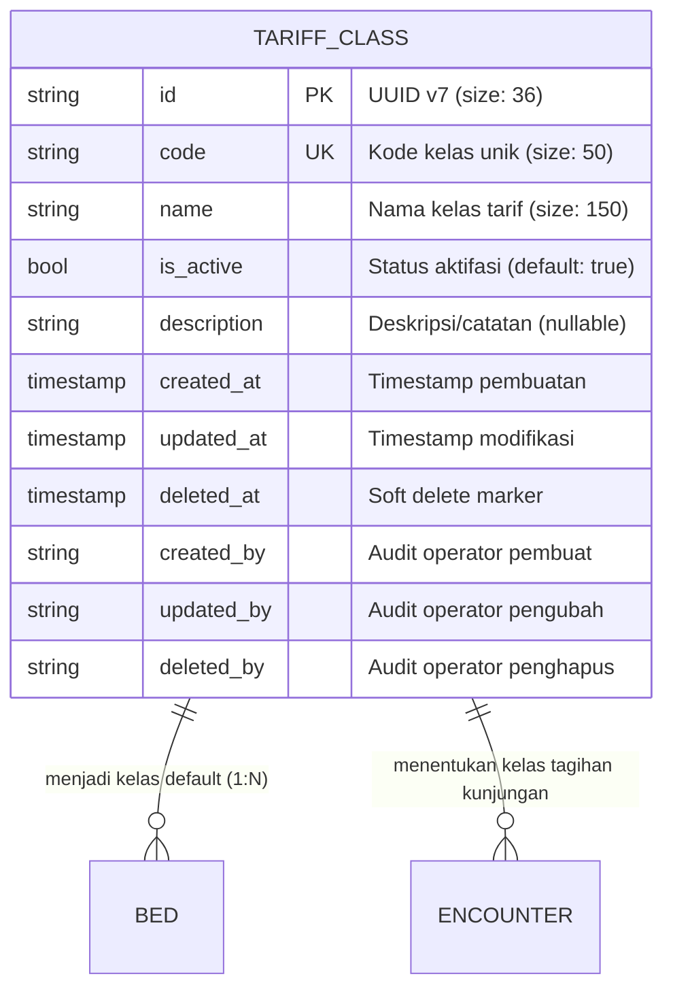

# Tariff Class (Kelas Tarif)

Dokumentasi ini ditujukan bagi kontributor (developer dan AI agent) agar memahami konteks bisnis, integritas data, dan aturan operasional entitas `TariffClass` di HOSIM-GO.

---

## 1. 🎯 Gambaran & Konteks Bisnis

Dalam manajemen rumah sakit, `TariffClass` mengacu pada **kelompok/kategori tarif** yang mengatur kelas tagihan layanan medis dan akomodasi rawat inap pasien. Entitas ini memisahkan harga layanan dasar berdasarkan kenyamanan fasilitas atau ketentuan penjamin.

### Kategori Kelas Tarif Umum:
- **Kelas VVIP / VIP**: Layanan rawat inap dengan fasilitas premium/privat.
- **Kelas I, II, III**: Kelas rawat inap standar berjenjang (termasuk kesiapan penyesuaian menuju regulasi KRIS / Kelas Rawat Inap Standar).
- **Non-Kelas**: Digunakan untuk layanan non-rawat inap atau unit tindakan bersama yang tarifnya flat (seperti Poliklinik Rawat Jalan, IGD, Kamar Operasi/OK, VK/Bersalin, Laboratorium, dan Radiologi).

> [!NOTE]
> `TariffClass` berbeda dengan `Customer` (Penjamin Bayar). `Customer` menentukan **siapa yang membayar** (BPJS, Asuransi, Pribadi), sedangkan `TariffClass` menentukan **acuan tarif/kelas layanan** yang digunakan saat perhitungan tagihan.

---

## 2. 🛡️ Invariant & Aturan Bisnis (Non-Negotiable)

1. **Encounter Assignment**: Setiap encounter atau registrasi pasien (baik rawat jalan, gawat darurat, maupun rawat inap) **WAJIB** memiliki referensi ke `TariffClass` yang valid.
2. **Acuan Buku Tarif (Master Pricing)**: `TariffClass` menjadi parameter utama penentu matriks harga pada modul *Billing* dan *Tariff Policy*.
3. **Uniqueness**: Kode kelas tarif (`code`) bersifat unik (`UNIQUE`) dan case-sensitive/normalized.
4. **Referential Integrity on Delete**:
   - Kelas tarif yang telah dirujuk oleh buku tarif aktif, billing, atau encounter pasien **DILARANG di-hard delete**.
   - Penghapusan hanya dilakukan secara logis (*soft delete* via `deleted_at`) atau dengan mematikan status operasional (`is_active = false`).
5. **Jalur Arsitektur (Jalur A - Master Data)**:
   - Mengikuti alur: `HTTP Handler -> Service -> Repository -> PostgreSQL`.
   - Mutasi data mencatat jejak audit `created_by`, `updated_by`, dan `deleted_by` dari konteks operator.

---

## 3. 📊 Relasi & Kardinalitas Data

---

## 4. 📂 Peta File Sumber Daya (Code Tour)

- [`entity.go`](file:///c:/laragon/www/hosim-go/internal/finance/tariffclass/entity.go): Definisi struct `TariffClass`, GORM tags, mapping tabel `tariff_classes`, dan hook UUIDv7 `BeforeCreate`.
- [`repository.go`](file:///c:/laragon/www/hosim-go/internal/finance/tariffclass/repository.go): Kontrak interface `Repository` dan implementasi query GORM dengan filter paginasi/pencarian.
- [`service.go`](file:///c:/laragon/www/hosim-go/internal/finance/tariffclass/service.go): Kontrak interface `Service` serta validasi bisnis (uniqueness, normalisasi string, penanganan error).
- [`handler.go`](file:///c:/laragon/www/hosim-go/internal/finance/tariffclass/handler.go): HTTP transport Gin (`Handler`), route registration, parsing request/query, dan otorisasi permission RBAC.
