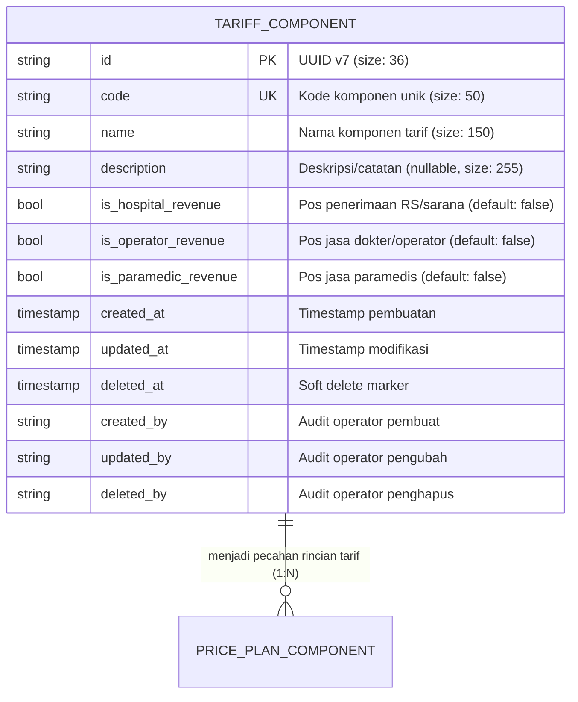

# Tariff Component (Komponen Tarif)

Dokumentasi ini ditujukan bagi kontributor (developer dan AI agent) agar memahami konteks bisnis, integritas data, dan aturan operasional entitas `TariffComponent` di HOSIM-GO.

---

## 1. 🎯 Gambaran & Konteks Bisnis

Dalam operasional rumah sakit dan sistem billing (SIMRS), total biaya suatu layanan atau tindakan medis (misalnya operasi, konsultasi, rontgen, atau tindakan rawat jalan) tidak dialokasikan ke satu pos penerimaan saja, melainkan dipecah menjadi beberapa **komponen tarif**.

Entitas `TariffComponent` merepresentasikan definisi pos-pos pecahan tarif tersebut dan menentukan peruntukan hasil pendapatannya:
- **Jasa Rumah Sakit / Sarana (`is_hospital_revenue`)**: Pendapatan yang masuk ke kas rumah sakit untuk menutup biaya fasilitas, sewa ruangan, depresiasi alat medis, dan utilitas.
- **Jasa Medis / Operator (`is_operator_revenue`)**: Bagian pendapatan yang menjadi hak dokter penanggung jawab atau operator tindakan (fee jasa medis).
- **Jasa Paramedis (`is_paramedic_revenue`)**: Bagian pendapatan untuk perawat, bidan, asisten anastesi, atau tenaga kesehatan pendukung.

> [!NOTE]
> `TariffComponent` mendefinisikan **kategori pos pendapatan**, sedangkan besaran nominal uangnya (Rp) diatur dalam modul **Price Plan (Buku Tarif)** berdasarkan kombinasi layanan dan `TariffClass`.

---

## 2. 🛡️ Invariant & Aturan Bisnis (Non-Negotiable)

1. **Uniqueness**: Kode komponen tarif (`code`) bersifat unik (`UNIQUE`) pada level database.
2. **Flag Penerimaan Valid**: Setidaknya satu dari flag penerimaan (`is_hospital_revenue`, `is_operator_revenue`, `is_paramedic_revenue`) disarankan bernilai `true` agar komponen memiliki tujuan alokasi pendapatan yang jelas.
3. **Soft Delete & Audit Trail**:
   - Penghapusan hanya dilakukan secara logis (*soft delete* via `deleted_at`).
   - Setiap mutasi data mencatat jejak audit `created_by`, `updated_by`, dan `deleted_by` dari operator yang login.
4. **Jalur Arsitektur (Jalur A - Master Data)**:
   - Mengikuti pola: `HTTP Handler -> Service -> Repository -> PostgreSQL`.
   - Tidak melakukan side-effect ke modul lain secara langsung.

---

## 3. 📊 Relasi & Kardinalitas Data



---

## 4. 📂 Peta File Sumber Daya (Code Tour)

- [`entity.go`](entity.go): Definisi struct entitas GORM `TariffComponent`, hook `BeforeCreate` untuk auto-generate UUID v7, dan nama tabel `tariff_components`.
- [`repository.go`](repository.go): Interface `Repository` dan implementasi query GORM (`Create`, `Update`, `Delete`, `FindByID`, `FindByCode`, `FindAll`).
- [`service.go`](service.go): Interface `Service` dan logika validasi sintaks/keunikan kode, sanitasi string, serta mapping request DTO ke entitas.
- [`handler.go`](handler.go): Transport layer Gin HTTP handler untuk endpoint REST API dan validasi parameter pagination.
- [`doc.go`](doc.go): Dokumentasi package Go.

---

## 5. 🌐 Kontrak REST API

Base Path: `/api/v1/tariff-components` (Terproteksi JWT)

| Method | Endpoint | Permission | Deskripsi |
|---|---|---|---|
| `POST` | `/tariff-components` | `tariff_component:create` | Tambah komponen tarif baru |
| `GET` | `/tariff-components` | `tariff_component:read` | List komponen tarif (paginasi & pencarian) |
| `GET` | `/tariff-components/:id` | `tariff_component:read` | Detail komponen tarif berdasarkan ID |
| `PUT` | `/tariff-components/:id` | `tariff_component:update` | Ubah data komponen tarif |
| `DELETE` | `/tariff-components/:id` | `tariff_component:delete` | Soft delete komponen tarif |

### Contoh Request Body (`POST` / `PUT`)
```json
{
  "code": "KOMP-001",
  "name": "Jasa Medis Dokter Spesialis",
  "description": "Komponen jasa dokter spesialis",
  "is_hospital_revenue": false,
  "is_operator_revenue": true,
  "is_paramedic_revenue": false
}
```
