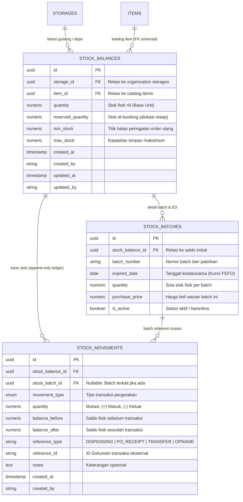

# Product Requirement Document (PRD): Inventory Stock Balances Domain

## 1. Ringkasan Eksekutif & Tujuan

Domain `internal/inventory` bertanggung jawab atas pengelolaan saldo stok fisik, kartu stok (buku besar mutasi), pelacakan nomor batch & tanggal kedaluwarsa (*expiry date*), serta manajemen kuantitas booking (*reserved quantity*) di seluruh gudang dan depo rumah sakit.

PRD ini dirancang secara **pragmatis dan terstandar**, membatasi kompleksitas berlebih (tanpa worker otomatis atau mekanisme check-in berbelit), namun tetap mempertahankan prinsip dasar keandalan data medis:
1. **Pencatatan Saldo Tunggal (Base Unit Only)**: Seluruh saldo disimpan dalam satuan terkecil produk untuk menghindari pecahan desimal.
2. **Konsep `reserved_quantity`**: Menjaga integritas ketersediaan stok saat ada alokasi resep yang belum diserahkan.
3. **Pelacakan Batch & FEFO (*First Expired, First Out*)**: Memprioritaskan pengeluaran obat dengan masa kedaluwarsa terdekat.
4. **Buku Besar Append-Only (`stock_movements`)**: Riwayat pergerakan barang tidak boleh diubah/dihapus demi keperluan audit finansial dan medis.

---

## 2. Arsitektur Data & Model Relasional

Modul inventory menghubungkan data katalog ([`internal/catalog/item`](file:///c:/laragon/www/hosim-go/internal/catalog/item)) dengan lokasi fisik penyimpanan ([`internal/organization/storage`](file:///c:/laragon/www/hosim-go/internal/organization/storage)).



---

## 3. Spesifikasi Kolom & Integritas Basis Data

### 3.1 Tabel `stock_balances` (Saldo Agregat per Depo)

| Kolom | Tipe Data | Constraint | Penjelasan |
|---|---|---|---|
| `id` | `UUID` | Primary Key | UUID v7 |
| `storage_id` | `UUID` | Foreign Key, Not Null | Merujuk ke `storages.id` (Gudang/Depo) |
| `item_id` | `UUID` | Foreign Key, Not Null | Merujuk ke `items.id` |
| `quantity` | `NUMERIC(15,4)` | Not Null, Default 0 | Saldo fisik riil saat ini (selalu dalam base unit) |
| `reserved_quantity` | `NUMERIC(15,4)` | Not Null, Default 0 | Kuantitas yang sedang dibooking oleh resep/alokasi |
| `min_stock` | `NUMERIC(15,4)` | Not Null, Default 0 | Batas stok minimum |
| `max_stock` | `NUMERIC(15,4)` | Not Null, Default 0 | Batas stok maksimum |

#### Integritas Database (Constraints):
- **Unique Constraint**: `UNIQUE (storage_id, item_id)` — Memastikan hanya ada 1 baris saldo per item di satu lokasi depo.
- **Check Constraint Saldo Positif**: `CHECK (quantity >= 0)` — Mencegah stok fisik minus di level database.
- **Check Constraint Booking Valid**: `CHECK (reserved_quantity >= 0 AND reserved_quantity <= quantity)` — Mencegah kuantitas booking minus atau melebihi stok fisik riil.

---

### 3.2 Tabel `stock_batches` (Detail Batch & FEFO)

| Kolom | Tipe Data | Constraint | Penjelasan |
|---|---|---|---|
| `id` | `UUID` | Primary Key | UUID v7 |
| `stock_balance_id` | `UUID` | Foreign Key, Not Null | Relasi ke `stock_balances.id` |
| `batch_number` | `VARCHAR(50)` | Not Null | Nomor Lot/Batch dari produsen |
| `expired_date` | `DATE` | Not Null, Index | Tanggal kedaluwarsa untuk pengurutan FEFO |
| `quantity` | `NUMERIC(15,4)` | Not Null, Default 0 | Sisa stok fisik pada batch ini |
| `purchase_price` | `NUMERIC(15,2)` | Default 0 | Harga perolehan/beli satuan |
| `is_active` | `BOOLEAN` | Default true | `false` jika obat ditarik/rusak/dikarantina |

#### Integritas Database:
- **Unique Constraint**: `UNIQUE (stock_balance_id, batch_number, expired_date)`.
- **Check Constraint**: `CHECK (quantity >= 0)`.

---

### 3.3 Tabel `stock_movements` (Kartu Stok / Audit Ledger)

Tabel ini bersifat **Append-Only** (hanya `INSERT`, dilarang `UPDATE` atau `DELETE`).

| Kolom | Tipe Data | Constraint | Penjelasan |
|---|---|---|---|
| `id` | `UUID` | Primary Key | UUID v7 |
| `stock_balance_id` | `UUID` | Foreign Key, Not Null | Saldo item & lokasi terkait |
| `stock_batch_id` | `UUID` | Foreign Key, Nullable | Batch fisik yang bergerak (jika ada) |
| `movement_type` | `VARCHAR(30)` | Not Null | Jenis transaksi |
| `quantity` | `NUMERIC(15,4)` | Not Null | Nilai pergerakan: Positif (+) atau Negatif (-) |
| `balance_before` | `NUMERIC(15,4)` | Not Null | Saldo fisik sebelum mutasi |
| `balance_after` | `NUMERIC(15,4)` | Not Null | Saldo fisik setelah mutasi |
| `reference_type` | `VARCHAR(50)` | Not Null | Asal transaksi: `DISPENSING`, `PO_RECEIPT`, dll |
| `reference_id` | `VARCHAR(36)` | Not Null | UUID referensi transaksi asal |
| `notes` | `TEXT` | Nullable | Catatan mutasi |
| `created_at` | `TIMESTAMP` | Not Null | Waktu pencatatan mutasi |
| `created_by` | `VARCHAR(50)` | Not Null | Identitas staf/user penanggung jawab |

---

## 4. Mekanisme Standar Operasional Kuantitas Stok

### 4.1 Rumus Ketersediaan Bebas (`Available Quantity`)

$$\text{Available Quantity} = \text{quantity} - \text{reserved\_quantity}$$

- **Stok Fisik (`quantity`)**: Jumlah obat yang secara kasat mata ada di rak/lemari depo.
- **Stok Bebas (`Available`)**: Jumlah obat yang aman untuk diresepkan dokter lain.

---

### 4.2 Tiga Alur Dasar Transaksi Stok

#### 1. Reservasi Stok (`Reserve`)
- **Trigger**: Resep obat diterbitkan / disimpan oleh dokter.
- **Operasi Database**:
  - Validasi bahwa `(quantity - reserved_quantity) >= request_qty`.
  - Naikkan kuantitas booking: `reserved_quantity = reserved_quantity + request_qty`.
  - *Stok fisik (`quantity`) TIDAK berubah. Tidak mencatat `stock_movements`.*

#### 2. Penyerahan Obat (`Dispense`)
- **Trigger**: Kasir farmasi menyelesaikan penyerahan obat fisik ke pasien.
- **Operasi Database (Dalam 1 DB Transaction)**:
  - Kurangi stok fisik: `quantity = quantity - request_qty`.
  - Lepas kuantitas booking: `reserved_quantity = reserved_quantity - request_qty`.
  - Kurangi stok batch terkait (sesuai urutan FEFO).
  - Catat kartu stok di `stock_movements` (`quantity = -request_qty`, `movement_type = 'DISPENSE'`).

#### 3. Pembatalan Resep (`Release / Cancel`)
- **Trigger**: Resep dibatalkan oleh dokter atau pasien membatalkan pengambilan.
- **Operasi Database**:
  - Lepas kuantitas booking: `reserved_quantity = reserved_quantity - request_qty`.
  - *Stok fisik (`quantity`) TIDAK berubah. Stok bebas otomatis pulih.*

#### 4. Penerimaan Barang Pengadaan (`Purchase Receipt`)
- **Trigger**: Gudang menerima pengiriman barang dari PBF/Vendor.
- **Operasi Database**:
  - Tambah stok fisik: `quantity = quantity + received_qty`.
  - Tambah atau buat row baru di `stock_batches` dengan kuantitas dan tanggal ED terkait.
  - Catat kartu stok di `stock_movements` (`quantity = +received_qty`, `movement_type = 'PURCHASE_RECEIPT'`).

---

## 5. Algoritma Pengeluaran Barang FEFO (*First Expired, First Out*)

Ketika melakukan pemotongan stok obat (`Dispense`), sistem memilih batch berdasarkan tanggal kedaluwarsa terdekat:

```sql
SELECT id, batch_number, expired_date, quantity
FROM stock_batches
WHERE stock_balance_id = :balance_id
  AND is_active = TRUE
  AND quantity > 0
ORDER BY expired_date ASC, created_at ASC;
```

Jika kuantitas yang dibutuhkan melebihi sisa 1 batch, sistem secara otomatis memotong batch pertama hingga habis (0), lalu melanjutkan pemotongan ke batch berikutnya (*multi-batch allocation*).

---

## 6. Desain Endpoint API & Service Interface

### 6.1 Read Path (Pengecekan Saldo & Kartu Stok)
- `GET /api/v1/inventory/balances`: Daftar stok per depo dengan filter `storage_id`, `item_id`, `is_low_stock` (stok < min_stock), pagination.
- `GET /api/v1/inventory/balances/:id`: Detail saldo tertentu beserta rincian batch aktifnya (`stock_batches`).
- `GET /api/v1/inventory/balances/:id/movements`: Laporan kartu stok (buku besar riwayat mutasi).

### 6.2 Service Contract (Jalur B Use Case)

Modul lain (Farmasi, Rawat Inap, Pengadaan) berinteraksi dengan inventory melalui service interface:

```go
type StockService interface {
    // Dipanggil modul Farmasi saat dokter simpan resep
    ReserveStock(ctx context.Context, cmd ReserveStockCommand) error

    // Dipanggil modul Farmasi saat resep dibatalkan
    ReleaseStock(ctx context.Context, cmd ReleaseStockCommand) error

    // Dipanggil modul Farmasi saat obat diserahkan ke pasien
    DispenseStock(ctx context.Context, cmd DispenseStockCommand) error

    // Dipanggil modul Pengadaan saat barang masuk dari PBF
    ReceivePurchase(ctx context.Context, cmd ReceivePurchaseCommand) error

    // Mutasi antar-depo (misal Gudang Utama -> Depo IGD)
    TransferStock(ctx context.Context, cmd TransferStockCommand) error
}
```

---

## 7. Struktur Kode & Organisasi Package

Untuk menjaga kode tetap pragmatis, mudah dipelihara, dan mencegah masalah **Circular Import** di bahasa Go, seluruh entitas inti saldo dan mutasi stok diorganisasikan dalam satu package flat di `internal/inventory`:

### 7.1 Rationale (Alasan Arsitektural)
1. **Single Aggregate Boundary**: `StockBalance`, `StockBatch`, dan `StockMovement` merupakan satu kesatuan data yang selalu di-query, divalidasi, dan di-commit dalam satu transaksi database yang sama.
2. **Bebas Circular Dependency**: Memisahkan `stockbalance` dan `stockmovement` ke dalam sub-folder berbeda akan menyebabkan ketergantungan melingkar antar-package yang dilarang oleh Go compiler.

### 7.2 Struktur Layout File

```text
internal/inventory/
├── PRD.md              <- Dokumen spesifikasi kebutuhan produk
├── doc.go              <- Dokumentasi package inventory
├── entity.go           <- Struct domain: StockBalance, StockBatch, StockMovement (GORM tags, UUID v7)
├── dto.go              <- Request & Response DTO untuk HTTP transport
├── repository.go       <- Port & implementasi database (GORM queries, row-level locking)
├── service.go          <- Logika bisnis Jalur B: Reserve, Dispense, Release, Purchase Receipt
├── handler.go          <- Gin HTTP Handler & routing endpoint stok
└── service_test.go     <- Unit testing validasi saldo, pencegahan race condition, & FEFO
```

