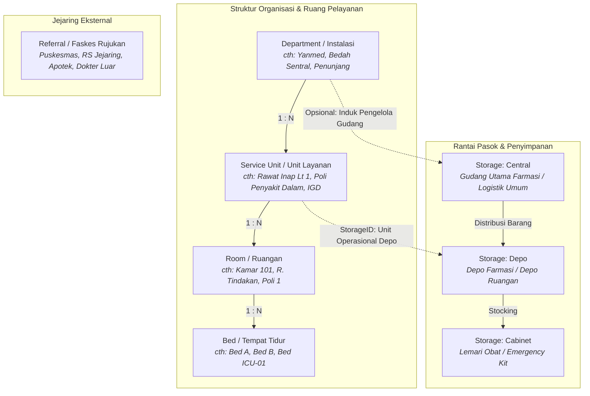

# Domain: Organization (Master Fasilitas & Struktur Rumah Sakit)

Domain `organization` adalah fondasi struktural di HOSIM-GO yang merepresentasikan struktur organisasi kerja, ruang fisik, kapasitas rawat inap, logistik penyimpanan, serta jejaring rujukan eksternal rumah sakit.

Modul ini menjadi rujukan utama (*source of truth*) bagi modul pelayanan (*Outpatient*, *Inpatient*, *Emergency*), logistik/farmasi (*Inventory*, *Pharmacy*), dan integrasi SatuSehat HL7 FHIR (`Organization` & `Location`).

---

## 🗺️ Peta Arsitektur & Hierarki Fasilitas

Rumah sakit membagi sumber dayanya ke dalam dua dimensi utama:
1. **Dimensi Pelayanan & Fasilitas Fisik**: `Department` ➔ `ServiceUnit` ➔ `Room` ➔ `Bed`.
2. **Dimensi Logistik Penyimpanan**: `Storage` (Central ➔ Depo ➔ Lemari/Cabinet).

---

## 📦 Sub-Modul & Pembagian Tanggung Jawab

| Sub-Modul | Entitas | Peran Bisnis di Rumah Sakit | Terhubung Ke |
|---|---|---|---|
| [`department`](./department/README.md) | `Department` | Instalasi / divisi induk (medis, penunjang, umum). | `serviceunit`, `storage` (opsional) |
| [`serviceunit`](./serviceunit/README.md) | `ServiceUnit` | Unit kerja operasional tempat pasien mendaftar dan dilayani. | `department`, `storage`, `room` |
| [`room`](./room/README.md) | `Room` | Ruang fisik (kamar rawat, kamar poli, OK, ICU). | `serviceunit`, `bed` |
| [`bed`](./bed/README.md) | `Bed` | Tempat tidur pasien rawat inap/tindakan (kapasitas terhitung). | `room` |
| [`storage`](./storage/README.md) | `Storage` | Gudang, depo farmasi, lemari obat, dan virtual in-transit. | `serviceunit`, `department` (opsional), `storage_parent` |
| [`referal`](./referal/README.md) | `Referal` | Faskes perujuk (rujukan masuk) atau tujuan rujukan (rujukan keluar). | Modul pendaftaran/registrasi & bridging BPJS/SatuSehat |

---

## 🛡️ Batasan Modul & Aturan Akses (Module Boundaries)

Sesuai aturan arsitektur di [`AGENTS.md`](../../AGENTS.md):
1. **Ownership Tunggal**: Domain `organization` adalah satu-satunya pemilik (*owner*) mutasi tabel master fasilitas ini.
2. **Larangan Mutasi Lintas Modul**: Modul pelayanan (*Inpatient*, *Outpatient*, *Pharmacy*) **DILARANG** melakukan update langsung ke tabel `rooms`, `beds`, atau `storages`. Mutasi status (misal ketersediaan bed) dilakukan melalui kontrak/use-case resmi.
3. **Pemisahan Jalur CRUD vs Transaksi Bisnis**:
   - Master data CRUD sederhana (Department, Referal, Room) menggunakan **Jalur A** (`Handler` ➔ `Service` ➔ `Repository`).
   - Perubahan status kapasitas kritis (seperti alokasi Bed pada Rawat Inap atau pergerakan stok antar Storage) wajib menggunakan **Jalur B** dengan kontrol konkurensi (`FOR UPDATE` / atomic check).

---

## 🌐 Standar Interoperabilitas (Kemenkes SatuSehat & BPJS)

Entitas dalam domain ini dipetakan ke standar nasional:
- **SATUSEHAT HL7 FHIR**:
  - `Department` ➔ Resource [`Organization`](https://satusehat.kemkes.go.id) (`ihs_organization_id`).
  - `ServiceUnit` & `Room` & `Bed` ➔ Resource [`Location`](https://satusehat.kemkes.go.id) (`ihs_location_id`, physical type: `ro` / `bd`).
- **BPJS Kesehatan**:
  - `Referal` ➔ Bridging Faskes Rujukan VClaim (`PPK Perujuk`).
  - `Bed` ➔ Bridging Ketersediaan Kamar (Aplicare / Siranap Kemenkes).
