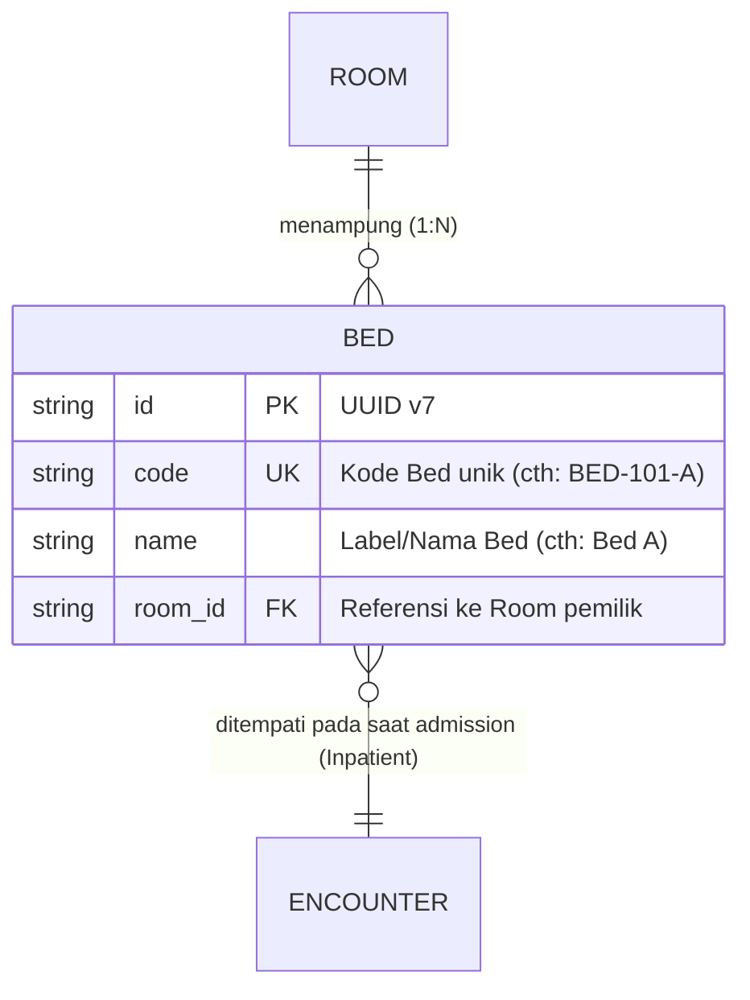
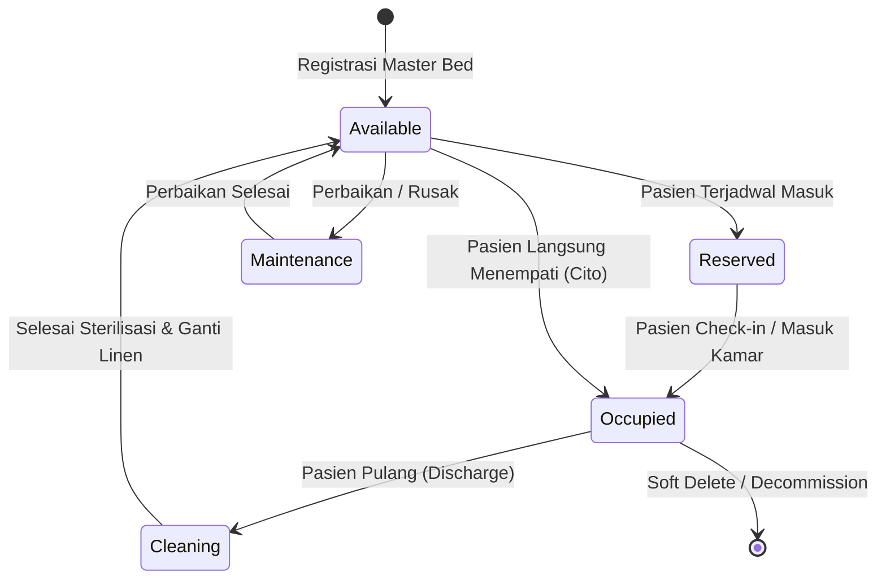

# Bed (Tempat Tidur Pasien)

Dokumentasi ini ditujukan bagi kontributor (developer dan AI agent) agar memahami konteks bisnis, integritas data, dan aturan operasional entitas `Bed` di HOSIM-GO.

---

## 1. 🎯 Gambaran & Konteks Bisnis

`Bed` merepresentasikan tempat tidur fisik yang digunakan pasien selama menjalani perawatan di rumah sakit. Bed dapat berada di berbagai setting pelayanan:
- **Rawat Inap Umum**: Bangsal umum, kamar kelas 1/2/3/KRIS, VIP, VVIP.
- **Intensive Care**: ICU, ICCU, NICU, PICU, HCU.
- **Unit Gawat Darurat (IGD)**: Bed observasi, bed triase, bed resusitasi.
- **Kamar Operasi (IBS)**: Meja operasi, bed ruang persiapan (*pre-op*), bed ruang pemulihan (*PACU/Recovery*).

> [!IMPORTANT]
> **Bed adalah Contended Resource (Sumber Daya yang Diperebutkan)**.
> Dalam operasional 24/7 rumah sakit, Bed menjadi penentu kuota penerimaan pasien rawat inap (*Admission*). Tidak boleh ada 2 pasien aktif menempati 1 bed yang sama pada periode waktu yang sama.

---

## 2. 📊 Relasi & Kardinalitas Data

- **Relasi ke Room**: `Room` memiliki relasi **1 to Many** dengan `Bed` (`room.id` = `bed.room_id`).
- **Batasan Kapasitas Ruangan**: Jumlah bed aktif yang terdaftar dalam suatu ruangan idealnya tidak melebihi atribut `Capacity` pada entitas `Room`.

---

## 3. 🔄 Lifecycle & Ketersediaan Bed

Walaupun pada level master data `Bed` mencatat inventaris fisik, pada transaksi operasional rawat inap (*Inpatient Admission / Transfer*), status operasional bed dikelola dengan aturan state transition berikut:

| Status | Makna Operasional | Boleh Dipesan Pasien Baru? |
|---|---|:---:|
| `AVAILABLE` | Siap pakai, bersih, siap menerima pasien baru | ✅ Ya |
| `RESERVED` | Telah dibooking untuk pasien yang sedang proses transfer/rujukan | ❌ Tidak |
| `OCCUPIED` | Sedang ditempati oleh pasien rawat inap aktif | ❌ Tidak |
| `CLEANING` | Pasien sudah keluar; perawat/cleaning service sedang membersihkan/sterilisasi | ❌ Tidak |
| `MAINTENANCE` | Fasilitas rusak (misal remote rusak, hidrolik rusak) | ❌ Tidak |

---

## 4. 🛡️ Invariant & Aturan Bisnis (Non-Negotiable)

1. **Uniqueness**: Kode bed (`code`) harus unik di seluruh sistem atau minimal unik dalam satu ruangan.
2. **Atomic Admission**: Saat modul *Inpatient* mengalokasikan bed ke pasien baru, query database **WAJIB** menggunakan proteksi konkurensi (misal `SELECT ... FOR UPDATE` atau conditional atomic update) untuk mencegah *double-booking* akibat dua petugas meng-assign bed yang sama bersamaan.
3. **Integrity on Delete**: Bed yang sedang berstatus `OCCUPIED` atau memiliki riwayat encounter aktif **DILARANG** dihapus keras (*hard delete*). Gunakan *soft delete* (`deleted_at`).
4. **Room Validation**: Saat menambahkan Bed baru, `room_id` yang direferensikan harus valid dan berstatus aktif.

---

## 5. 🌐 Standar Interoperabilitas (SatuSehat & Kemenkes)

- **SATUSEHAT HL7 FHIR**:
  - Merepresentasikan resource [`Location`](https://satusehat.kemkes.go.id).
  - Kode jenis fisik (`physicalType`): `bd` (*Bed*).
  - Atribut `partOf` mereferensikan resource `Location` tingkat ruangan (`Room`).
- **Siranap Kemenkes & BPJS Aplicare**:
  - Digunakan untuk sinkronisasi ketersediaan tempat tidur RS secara real-time ke portal publik Kemenkes dan Mobile JKN.

---

## 6. 📂 Peta File Sumber Daya (Code Tour)

- [`entity.go`](file:///c:/laragon/www/hosim-go/internal/organization/bed/entity.go): Definisi struct `Bed`, GORM tag, relasi `Room`, dan hook ID UUIDv7.
- [`doc.go`](file:///c:/laragon/www/hosim-go/internal/organization/bed/doc.go): Dokumentasi package Go.