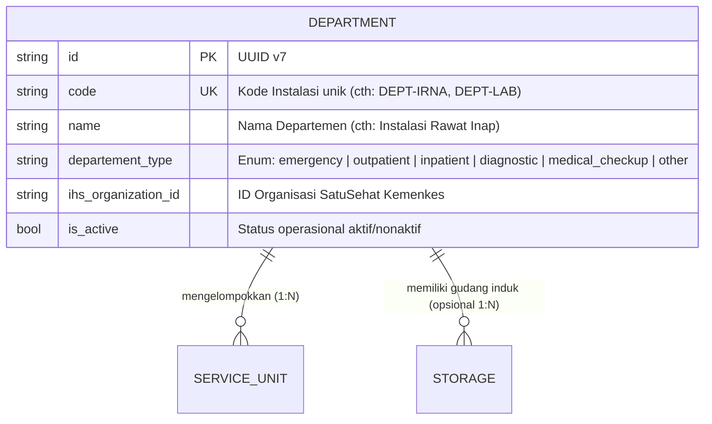

# Department (Instalasi / Departemen Rumah Sakit)

Dokumentasi ini ditujukan bagi kontributor (developer dan AI agent) agar memahami konteks bisnis, integritas data, dan aturan operasional entitas `Department` di HOSIM-GO.

---

## 1. 🎯 Gambaran & Konteks Bisnis

`Department` (sering disebut **Instalasi** atau **Divisi**) merupakan tingkatan tertinggi dalam struktur organisasi operasional rumah sakit di bawah Direksi. Department berfungsi mengelompokkan unit-unit pelayanan (*Service Unit*) dan fasilitas berdasarkan bidang fungsi atau disiplin medis.

Contoh departemen di rumah sakit:
- **Pelayanan Medis (Yanmed)**: Instalasi Gawat Darurat (IGD), Instalasi Rawat Jalan (IRJ), Instalasi Rawat Inap (IRNA), Bedah Sentral (IBS).
- **Penunjang Medis**: Instalasi Farmasi, Instalasi Radiologi, Laboratorium Patologi Klinik, Instalasi Rehabilitasi Medik.
- **Penunjang Non-Medis / Umum**: Instalasi Gizi/Dapur, Instalasi Pemeliharaan Sarana RS (IPSRS), CSSD/Sterilisasi, Rekam Medis.

> [!NOTE]
> Secara historis dan kompatibilitas database PostgreSQL, nama tabel yang digunakan adalah `departements` (didefinisikan melalui method `TableName()`).

---

## 2. 📊 Relasi & Kardinalitas Data

- **Satu Departemen memiliki Banyak Service Unit (1 : N)**:
  - *Contoh*: Departemen "Instalasi Rawat Jalan" menaungi Service Unit "Poli Penyakit Dalam", "Poli Anak", "Poli Gigi", dsb.
- **Relasi ke Storage**: Departemen logistik/farmasi dapat memiliki gudang induk (`central`).

---

## 3. 🏷️ Klasifikasi Tipe Departemen (`DepartementType`)

Definisi enum terpusat di [`pkg/enums/departement.go`](file:///c:/laragon/www/hosim-go/pkg/enums/departement.go):

| Tipe Enum | Nilai DB | Contoh Penerapan di Rumah Sakit |
|---|---|---|
| `DepartementTypeEmergency` | `emergency` | Instalasi Gawat Darurat (IGD) |
| `DepartementTypeOutpatient` | `outpatient` | Instalasi Rawat Jalan / Poliklinik Terpadu |
| `DepartementTypeInpatient` | `inpatient` | Instalasi Rawat Inap (IRNA) |
| `DepartementTypeDiagnostic` | `diagnostic` | Laboratorium, Radiologi, Patologi Anatomi |
| `DepartementTypeMCU` | `medical_checkup` | Unit Medical Check-Up terpadu |
| `DepartementTypeOther` | `other` | Farmasi, CSSD, Gizi, Administrasi, Logistik Umum |

---

## 4. 🛡️ Invariant & Aturan Bisnis (Non-Negotiable)

1. **Uniqueness**: Kode departemen (`code`) harus unik di seluruh sistem database (`uniqueIndex`).
2. **Integritas Penghapusan (Integrity on Delete)**:
   - Dilarang menghapus departemen yang masih memiliki `ServiceUnit` aktif di bawahnya.
   - Jika suatu departemen tidak lagi beroperasi, ubah flag `is_active = false` (hindari *hard delete*).
3. **Status Aktif**: Service Unit yang berada di bawah departemen non-aktif (`is_active = false`) tidak boleh digunakan untuk pendaftaran kunjungan baru.

---

## 5. 🌐 Standar Interoperabilitas (SatuSehat Kemenkes)

- **SATUSEHAT HL7 FHIR**:
  - Merepresentasikan Resource [`Organization`](https://satusehat.kemkes.go.id).
  - Kolom `ihs_organization_id` menyimpan Organization ID resmi yang diterbitkan oleh Kementerian Kesehatan RI untuk sub-unit faskes tersebut.
  - Menjadi bagian dari hierarki `partOf` di bawah Organization Rumah Sakit utama.

---

## 6. 📂 Peta File Sumber Daya (Code Tour)

- [`entity.go`](file:///c:/laragon/www/hosim-go/internal/organization/department/entity.go): Model `Department`, GORM tag, relasi, dan hook auto-UUID.
- [`repository.go`](file:///c:/laragon/www/hosim-go/internal/organization/department/repository.go): Query data departemen (Get, List, Filter by Type).
- [`service.go`](file:///c:/laragon/www/hosim-go/internal/organization/department/service.go): Validasi logika bisnis dan pengecekan keunikan kode.
- [`handler.go`](file:///c:/laragon/www/hosim-go/internal/organization/department/handler.go): Transport layer Gin HTTP REST API.
