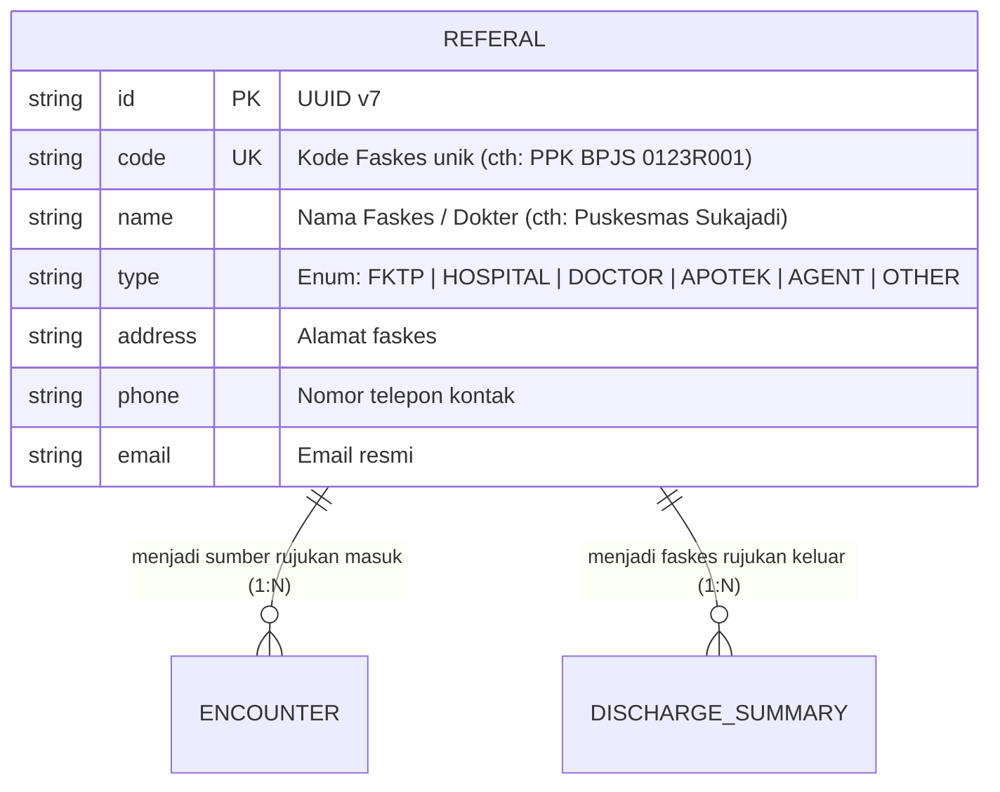

# Referal (Fasilitas Kesehatan & Jejaring Rujukan)

Dokumentasi ini ditujukan bagi kontributor (developer dan AI agent) agar memahami konteks bisnis, integritas data, dan aturan operasional entitas `Referal` di HOSIM-GO.

---

## 1. 🎯 Gambaran & Konteks Bisnis

`Referal` (Faskes Perujuk / Jejaring Rujukan) adalah direktori fasilitas kesehatan eksternal, dokter praktik mandiri, atau institusi mitra yang terhubung dalam ekosistem rujukan medis rumah sakit:

1. **Rujukan Masuk (*Inbound Referral*)**:
   - Pasien datang membawa surat rujukan dari Faskes Tingkat Pertama (FKTP / Puskesmas / Klinik) atau dokter praktik pribadi untuk mendapatkan penanganan spesialis/rawat inap di rumah sakit.
   - Esensial untuk validasi SEP (Surat Eligibilitas Peserta) BPJS Kesehatan VClaim.
2. **Rujukan Keluar (*Outbound Referral*)**:
   - Rumah sakit merujuk pasien ke fasilitas kesehatan lain yang memiliki kapabilitas lebih tinggi (cth: RS Tipe A / RS Khusus Jantung) atau merujuk balik pasien stabil (*Program Rujuk Balik / PRB*) ke Puskesmas/Apotek terdekat.

---

## 2. 🏷️ Klasifikasi Tipe Faskes (`ReferalType`)

Definisi enum terpusat di [`pkg/enums/referal.go`](file:///c:/laragon/www/hosim-go/pkg/enums/referal.go):

| Tipe Enum | Nilai DB | Penjelasan Bisnis & Contoh |
|---|---|---|
| `ReferalTypeFKTP` | `FKTP` | Fasilitas Kesehatan Tingkat Pertama (Puskesmas, Klinik Pratama, Dokter Keluarga). Paling dominan pada rujukan masuk BPJS. |
| `ReferalTypeHospital` | `HOSPITAL` | Rumah Sakit jejaring (RS Tipe C, B, A, atau RS Khusus). |
| `ReferalTypeDoctor` | `DOCTOR` | Dokter spesialis atau dokter umum praktik perorangan di luar RS. |
| `ReferalTypeApotek` | `APOTEK` | Apotek mitra jejaring untuk penebusan obat Program Rujuk Balik (PRB) atau farmasi luar. |
| `ReferalTypeAgent` | `AGENT` | Perusahaan / Instansi asuransi / Agen rujukan korporat. |
| `ReferalTypeOther` | `OTHER` | Lembaga donor, dinas kesehatan, PMI, atau institusi rujukan lainnya. |

---

## 3. 📊 Relasi & Kardinalitas Data

- Terhubung dengan transaksi pendaftaran pasien (`Encounter`) pada saat pasien registrasi rawat jalan maupun rawat darurat.

---

## 4. 🛡️ Invariant & Aturan Bisnis (Non-Negotiable)

1. **Uniqueness Kode Faskes**:
   - Kolom `code` harus unik (`uniqueIndex`). Pada integrasi BPJS Kesehatan, kolom ini diisi kode PPK resmi dari BPJS (misal kode 8 digit).
2. **Kesesuaian Tipe**:
   - Nilai kolom `type` wajib divalidasi menggunakan method `IsValid()` pada enum `ReferalType`.
3. **Integritas Penghapusan (Integrity on Delete)**:
   - Dilarang menghapus data faskes yang sudah pernah digunakan dalam riwayat kunjungan (`Encounter`) pasien.
   - Gunakan mekanisme *soft delete* (`deleted_at`).

---

## 5. 🌐 Standar Interoperabilitas (BPJS VClaim & SatuSehat)

- **BPJS Kesehatan (VClaim)**:
  - Dipetakan ke entitas **PPK Perujuk** saat pembuatan SEP Rawat Jalan / Inap.
- **SATUSEHAT HL7 FHIR**:
  - Merepresentasikan Resource [`Organization`](https://satusehat.kemkes.go.id) eksternal penyedia layanan rujukan.

---

## 6. 📂 Peta File Sumber Daya (Code Tour)

- [`entity.go`](file:///c:/laragon/www/hosim-go/internal/organization/referal/entity.go): Model `Referal`, GORM tag, validasi enum, dan hook auto-UUID.
- [`repository.go`](file:///c:/laragon/www/hosim-go/internal/organization/referal/repository.go): Operasi database (Get by Code/ID, List by Type, Pagination).
- [`service.go`](file:///c:/laragon/www/hosim-go/internal/organization/referal/service.go): Validasi tipe enum dan keunikan kode.
- [`handler.go`](file:///c:/laragon/www/hosim-go/internal/organization/referal/handler.go): Transport layer Gin HTTP REST API.