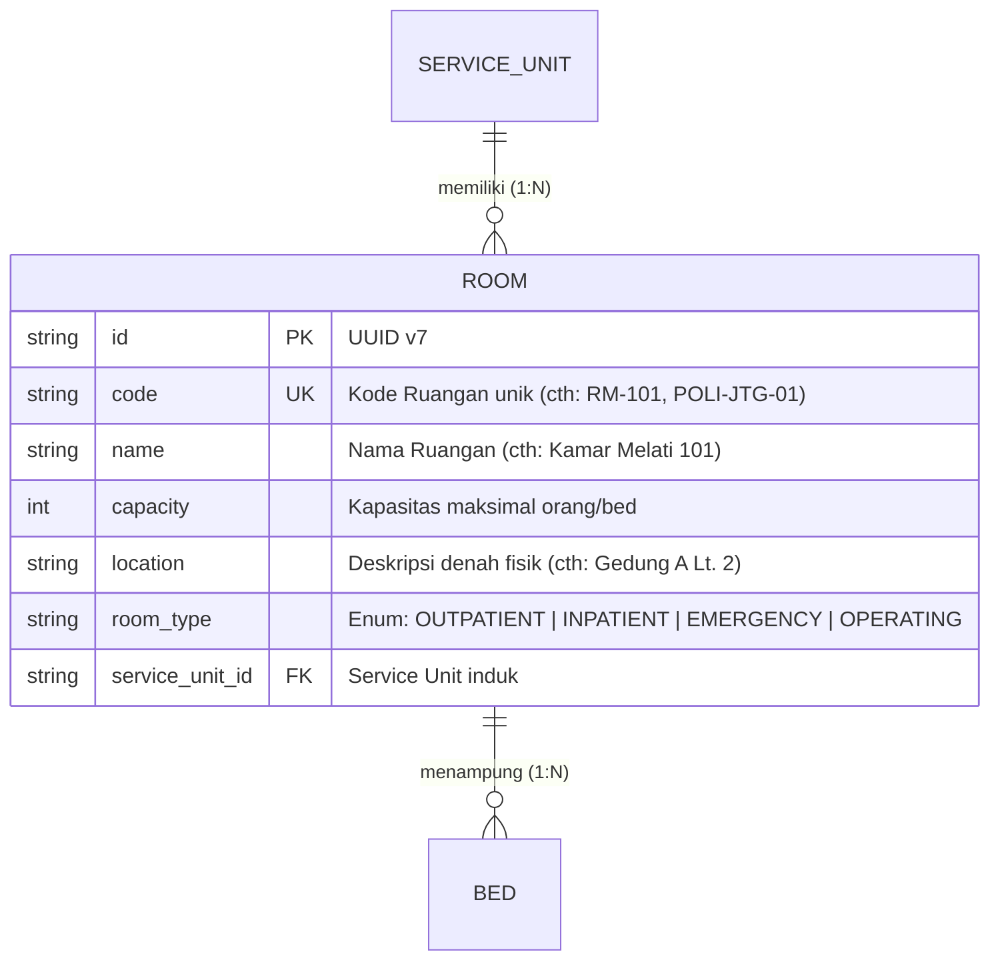

# Room (Ruangan Pelayanan Rumah Sakit)

Dokumentasi ini ditujukan bagi kontributor (developer dan AI agent) agar memahami konteks bisnis, integritas data, dan aturan operasional entitas `Room` di HOSIM-GO.

---

## 1. 🎯 Gambaran & Konteks Bisnis

`Room` merepresentasikan ruang fisik di lingkungan rumah sakit tempat pelayanan medis atau penunjang diselenggarakan. Karakteristik ruangan ditentukan oleh tipe operasionalnya:

- **Rawat Inap (`INPATIENT`)**: Bangsal (*ward*) atau kamar perawatan inap yang menampung satu atau beberapa tempat tidur (`Bed`).
- **Rawat Jalan / Poliklinik (`OUTPATIENT`)**: Ruang konsultasi dan pemeriksaan dokter spesialis/umum (misal: Ruang Poli Anak 1, Poli Mata).
- **Gawat Darurat (`EMERGENCY`)**: Ruangan di area IGD (R. Triase, R. Tindakan Bedah, R. Resusitasi).
- **Kamar Operasi (`OPERATING`)**: Ruang bedah sentral steril (OK 1, OK 2, Ruang Induksi).

> [!NOTE]
> **Pemisahan Peran dengan Storage**:
> Entitas `Room` adalah area pelayanan fisik pasien, **bukan** gudang penyimpanan barang. Ruangan tidak memiliki relasi langsung ke `Storage`. Logistik dan perbekalan obat dikelola pada tingkat `ServiceUnit` melalui relasi ke `Storage` (Depo).

---

## 2. 📊 Relasi & Kardinalitas Data

- **Satu Service Unit memiliki Banyak Ruangan (1 : N)**:
  - *Contoh*: Service Unit "Instalasi Rawat Inap Melati" menaungi Room "Kamar 101", "Kamar 102", dst.
  - *Contoh*: Service Unit "Poliklinik Spesialis" menaungi Room "Ruang Konsultasi Jantung", "Ruang Konsultasi Paru".
- **Satu Ruangan memiliki Banyak Bed (1 : N)**:
  - Berlaku terutama untuk ruangan berjenis `INPATIENT`, `EMERGENCY`, atau `OPERATING`.

---

## 3. 🏷️ Klasifikasi Tipe Ruangan (`RoomType`)

Definisi enum terpusat di [`pkg/enums/room.go`](file:///c:/laragon/www/hosim-go/pkg/enums/room.go):

| Tipe Enum | Nilai DB | Karakteristik Operasional | Memiliki Bed? |
|---|---|---|:---:|
| `RoomTypeOutpatient` | `OUTPATIENT` | Ruang periksa poliklinik rawat jalan; turnover pasien per sesi jadwal dokter | ❌ Tidak (hanya meja periksa) |
| `RoomTypeInpatient` | `INPATIENT` | Kamar rawat menginap 24 jam; terikat kelas perawatan dan bed | ✅ Ya |
| `RoomTypeEmergency` | `EMERGENCY` | Ruang tindakan IGD dan observasi intensif durasi singkat | ✅ Ya (Bed observasi/tindakan) |
| `RoomTypeOperating` | `OPERATING` | Ruang bedah steril dengan instrumen anestesi & bedah | ✅ Ya (Meja operasi) |

---

## 4. 🛡️ Invariant & Aturan Bisnis (Non-Negotiable)

1. **Uniqueness**: Kode ruangan (`code`) harus unik di seluruh sistem database (`uniqueIndex`).
2. **Kapasitas Non-Negatif**: Nilai `capacity` harus berupa integer `>= 0`.
3. **Integritas Penghapusan (Integrity on Delete)**:
   - Dilarang menghapus ruangan jika masih terdapat data `Bed` aktif yang terdaftar di dalamnya.
   - Dilarang menghapus ruangan jika sedang digunakan dalam `Encounter` aktif.
4. **Relasi Wajib Service Unit**: Setiap pembuatan ruangan baru wajib mereferensikan `service_unit_id` yang valid dan aktif.

---

## 5. 🌐 Standar Interoperabilitas (SatuSehat HL7 FHIR)

- Dipetakan ke Resource [`Location`](https://satusehat.kemkes.go.id).
- Kode jenis fisik (`physicalType`): `ro` (*Room*).
- Atribut `partOf` mengarah ke resource `Location` dari `ServiceUnit` induknya.

---

## 6. 📂 Peta File Sumber Daya (Code Tour)

- [`entity.go`](file:///c:/laragon/www/hosim-go/internal/organization/room/entity.go): Model `Room`, GORM tag, relasi `ServiceUnit`, dan hook auto-UUID.
- [`repository.go`](file:///c:/laragon/www/hosim-go/internal/organization/room/repository.go): Query data ruangan (find by ID, search by service unit, pagination).
- [`service.go`](file:///c:/laragon/www/hosim-go/internal/organization/room/service.go): Validasi keunikan kode dan business rules.
- [`handler.go`](file:///c:/laragon/www/hosim-go/internal/organization/room/handler.go): Transport layer Gin HTTP REST API.