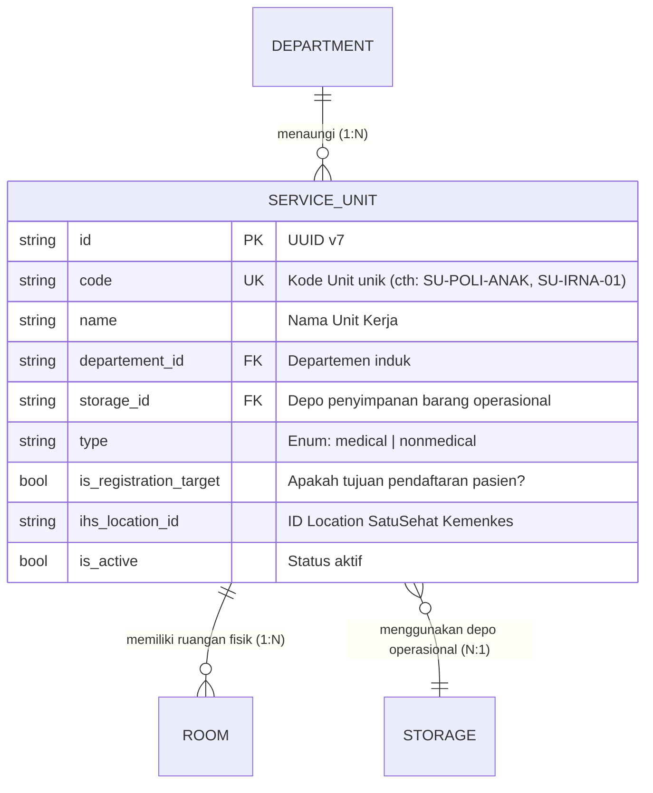

# ServiceUnit (Unit Pelayanan / Unit Kerja Rumah Sakit)

Dokumentasi ini ditujukan bagi kontributor (developer dan AI agent) agar memahami konteks bisnis, integritas data, dan aturan operasional entitas `ServiceUnit` di HOSIM-GO.

---

## 1. 🎯 Gambaran & Konteks Bisnis

`ServiceUnit` adalah unit kerja operasional yang berada di bawah naungan `Department`. Unit ini merupakan titik sentral operasional rumah sakit di mana:
1. Pasien mendaftar dan menerima pelayanan medis (misal: Poliklinik Mata, Rawat Inap Melati Lt. 1, IGD).
2. Layanan penunjang atau non-medis dijalankan (misal: Unit Rekam Medis, Unit Gizi, Unit Kebersihan & Sanitasi).

Dua atribut bisnis kunci:
- **`Type` (`medical` vs `nonmedical`)**: Membedakan unit yang berinteraksi langsung dalam proses klinis pasien dengan unit administratif/umum.
- **`IsRegistrationTarget`**: Menentukan apakah unit ini dapat dipilih sebagai tujuan saat pendaftaran pasien (*admission/check-in*). Misalnya: Poli Penyakit Dalam bernilai `true`, sedangkan Unit Sterilisasi (CSSD) bernilai `false`.

---

## 2. 📊 Relasi & Kardinalitas Data

- **Relasi ke Department**: `ServiceUnit` terhubung ke satu `Department` induk.
- **Relasi ke Storage**: Setiap unit kerja yang mengelola persediaan fisik (obat, alkes, linen, ATK) memiliki relasi ke `Storage` (Depo). Beberapa unit pelayanan dapat berbagi depo yang sama jika diperlukan.
- **Relasi ke Room**: `ServiceUnit` menaungi satu atau beberapa `Room` fisik.

---

## 3. 🏷️ Klasifikasi Tipe Unit (`ServiceUnitType`)

Definisi enum terpusat di [`pkg/enums/serviceunit.go`](file:///c:/laragon/www/hosim-go/pkg/enums/serviceunit.go):

| Tipe Enum | Nilai DB | Karakteristik Bisnis | Contoh Unit |
|---|---|---|---|
| `ServiceUnitMedical` | `medical` | Unit yang berhubungan langsung dengan tindakan medis/klinis pasien | Poli Jantung, IGD, Bangsal Bedah, Kamar Operasi, Laboratorium |
| `ServiceUnitNonMedical` | `nonmedical` | Unit pendukung operasional umum, logistik, dan manajerial | Unit Gizi & Dapur, Unit Laundry/Linen, IPSRS, Kasir Utama |

---

## 4. 🛡️ Invariant & Aturan Bisnis (Non-Negotiable)

1. **Uniqueness**: Kode unit (`code`) harus unik di seluruh sistem database (`uniqueIndex`).
2. **Validasi Tujuan Registrasi**:
   - Jika `is_registration_target = true`, maka unit ini wajib memiliki status `is_active = true`.
   - Modul registrasi pasien (*Encounter Creation*) **hanya boleh** menampilkan Service Unit yang memiliki `is_registration_target = true` dan `is_active = true`.
3. **Integritas Penghapusan (Integrity on Delete)**:
   - Dilarang menghapus Service Unit jika masih menaungi `Room` aktif atau memiliki riwayat kunjungan pasien (`Encounter`).
   - Gunakan penonaktifan via `is_active = false`.
4. **Validasi Storage**: `storage_id` yang direferensikan harus valid dan aktif.

---

## 5. 🌐 Standar Interoperabilitas (SatuSehat HL7 FHIR)

- **SATUSEHAT HL7 FHIR**:
  - Merepresentasikan Resource [`Location`](https://satusehat.kemkes.go.id).
  - Kolom `ihs_location_id` menyimpan Location ID yang diterbitkan oleh Kemenkes.
  - Atribut `managingOrganization` pada SatuSehat Location mengarah ke `ihs_organization_id` milik `Department` induknya.

---

## 6. 📂 Peta File Sumber Daya (Code Tour)

- [`entity.go`](file:///c:/laragon/www/hosim-go/internal/organization/serviceunit/entity.go): Model `ServiceUnit`, relasi `Department` & `Storage`, serta hook auto-UUID.
- [`repository.go`](file:///c:/laragon/www/hosim-go/internal/organization/serviceunit/repository.go): Query data unit (Find by ID, List, Filter by Registration Target).
- [`service.go`](file:///c:/laragon/www/hosim-go/internal/organization/serviceunit/service.go): Business logic, validasi storage, dan keunikan kode.
- [`handler.go`](file:///c:/laragon/www/hosim-go/internal/organization/serviceunit/handler.go): Transport layer Gin HTTP REST API.