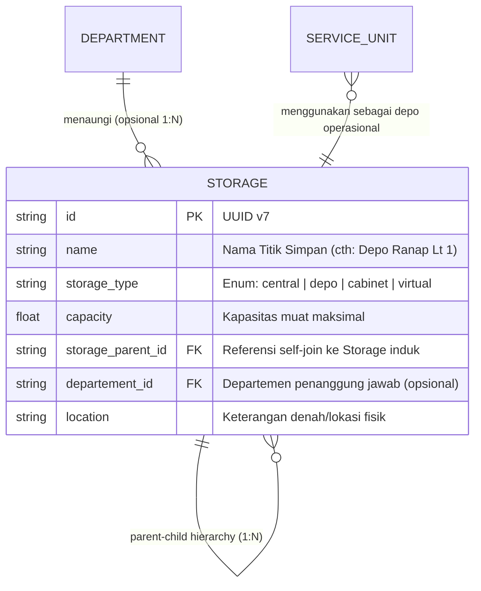
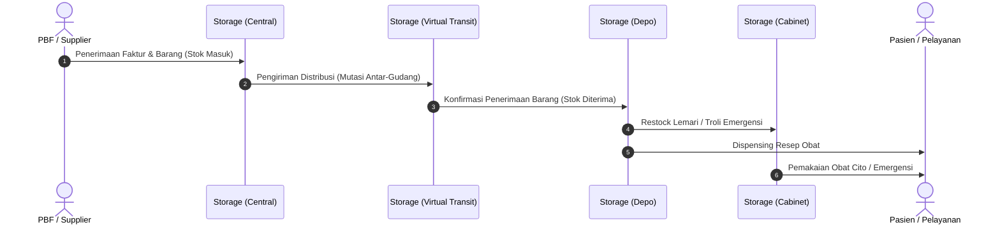

# Storage (Gudang, Depo, & Lemari Penyimpanan)

Dokumentasi ini ditujukan bagi kontributor (developer dan AI agent) agar memahami konteks bisnis, integritas data, dan aturan operasional entitas `Storage` di HOSIM-GO.

---

## 1. 🎯 Gambaran & Konteks Bisnis

`Storage` mengelola seluruh titik fisik dan logis penyimpanan barang (obat, alat kesehatan, linen, perlengkapan medis, dan logistik umum) di rumah sakit. 

Manajemen persediaan rumah sakit memiliki hierarki bertingkat untuk menjamin ketersediaan obat secara cepat di dekat pasien (*point of care*) sekaligus menjaga keamanan obat berisiko tinggi (*high alert / narkotika*).

---

## 2. 🏷️ Klasifikasi Tipe Storage (`StorageType`)

Definisi enum terpusat di [`pkg/enums/storage.go`](file:///c:/laragon/www/hosim-go/pkg/enums/storage.go):

| Tipe Enum | Nilai DB | Tingkat Hierarki | Peran & Contoh Nyata |
|---|---|:---:|---|
| `StorageTypeCentral` | `central` | Tier 1 (Utama) | **Gudang Induk**: Tempat penerimaan awal barang dari distributor/PBF (cth: Gudang Sentral Farmasi, Gudang Logistik Umum). |
| `StorageTypeDepo` | `depo` | Tier 2 (Distribusi) | **Depo Pelayanan**: Satelit farmasi di unit layanan (cth: Depo Farmasi IGD, Depo Rawat Inap Lt. 2, Depo OK/IBS). |
| `StorageTypeCabinet` | `cabinet` | Tier 3 (Penyimpanan Khusus) | **Lemari / Troli**: Unit penyimpanan terkecil di ruangan (cth: Lemari Narkotika, Troli Emergensi/Resusitasi, Lemari Linen). |
| `StorageTypeVirtual` | `virtual` | Pembantu (Transit) | **Lokasi Virtual**: Menampung stok yang sedang dalam perjalanan distribusi antar-gudang sebelum dikonfirmasi oleh penerima (*In-Transit*). |

---

## 3. 📊 Relasi & Kardinalitas Data

- **Hierarki Bertingkat (Self-Referencing)**:
  - `StorageParentID` menghubungkan `Cabinet` ke `Depo` induknya, dan `Depo` ke `Central` induknya.
- **Relasi ke Service Unit**:
  - `ServiceUnit` menunjuk ke satu `Storage` (biasanya bertipe `depo`) sebagai sumber perbekalan harian.
- **Relasi ke Department**:
  - Kolom `departement_id` bersifat opsional (*nullable*). Gudang sentral dapat berdiri independen di bawah logistik rumah sakit atau di bawah Instalasi Farmasi.

---

## 4. 📦 Alur Distribusi Persediaan (Supply Chain Workflow)

Pergerakan stok fisik di rumah sakit mengikuti siklus berikut:

> [!IMPORTANT]
> **Kaitan dengan Modul Inventory & Stock**:
> Batch barang dan saldo kuantitas stok **TIDAK** dicatat di entitas `Storage` ini, melainkan di modul `inventory` / `pharmacy`. Entitas `Storage` bertindak sebagai master lokasi (*location identifier*).

---

## 5. 🛡️ Invariant & Aturan Bisnis (Non-Negotiable)

1. **Integritas Siklus Hierarki (No Circular Hierarchy)**:
   - Suatu storage tidak boleh menunjuk dirinya sendiri atau turunannya sebagai `storage_parent_id`.
2. **Kapasitas Non-Negatif**:
   - `capacity` harus berupa nilai numerik `>= 0`.
3. **Integritas Penghapusan (Integrity on Delete)**:
   - Dilarang menghapus Storage jika masih menaungi child storage (sub-depo/lemari) aktif.
   - Dilarang menghapus Storage jika masih memiliki saldo stok aktif di modul inventori.

---

## 6. 📂 Peta File Sumber Daya (Code Tour)

- [`entity.go`](file:///c:/laragon/www/hosim-go/internal/organization/storage/entity.go): Definisi struct `Storage`, relasi self-join parent, relasi `Department`, dan hook auto-UUID.
- [`doc.go`](file:///c:/laragon/www/hosim-go/internal/organization/storage/doc.go): Dokumentasi ringkas package storage.