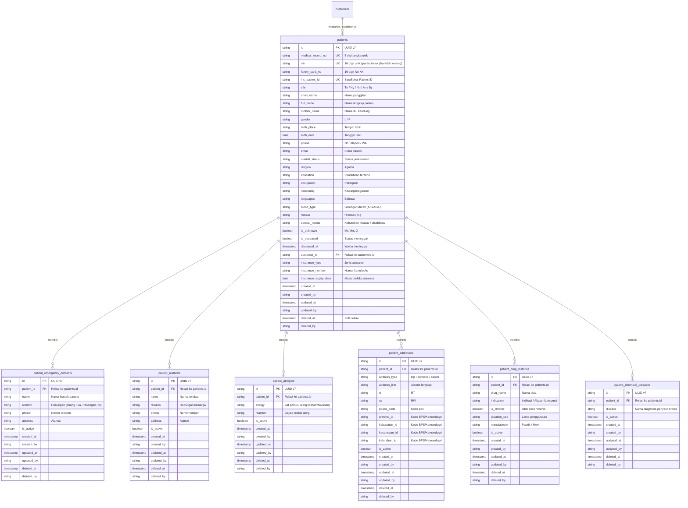
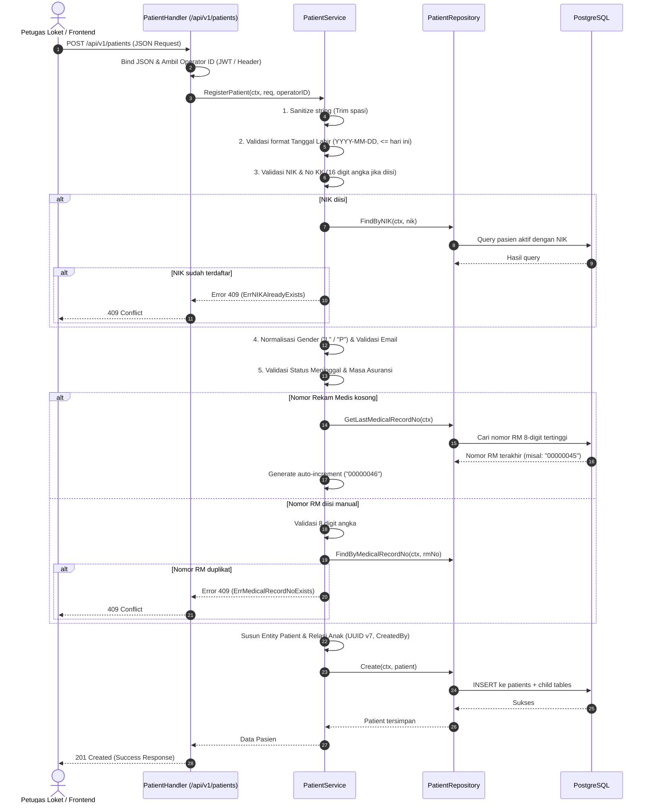
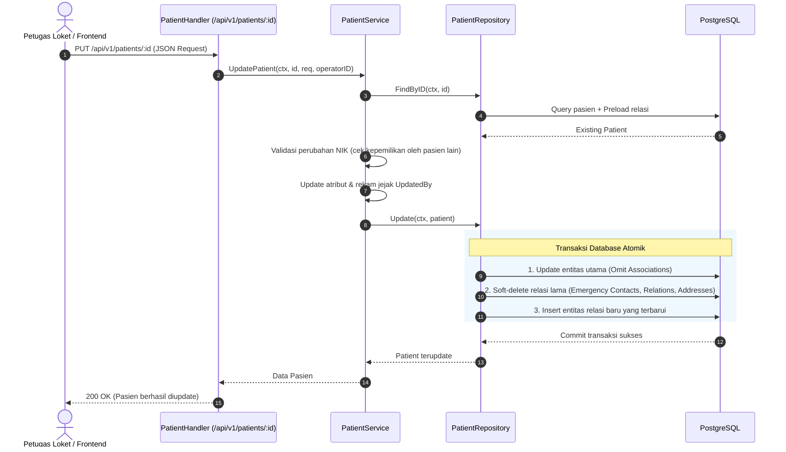

# Dokumentasi & Panduan Modul Master Data Pasien (`internal/patient`)

Dokumen ini merupakan panduan lengkap arsitektur, skema basis data, logika bisnis, serta integrasi API untuk modul **Master Data Pasien** pada backend **`hosim-go`**.

Modul ini dirancang sebagai fondasi utama Sistem Informasi Manajemen Rumah Sakit (SIMRS) yang selaras dengan regulasi Rekam Medis Elektronik (RME) serta interoperabilitas platform **Kemenkes SatuSehat**.

---

## 1. Fitur Utama & Standar Kemenkes SatuSehat

1. **Identitas Pasien & SatuSehat Ready**:
   - `NIK`: 16 digit nomor kependudukan unik (dapat dikosongkan untuk Bayi Baru Lahir / BBL atau Mr. X).
   - `FamilyCardNo`: 16 digit Nomor Kartu Keluarga (No. KK).
   - `IHSPatientID`: ID unik pasien pada platform SatuSehat Kemenkes (UUID).
   - `FullName`, `ShortName`, `Title` (Tn, Ny, Nn, An, By), dan `MotherName` (Nama Ibu Kandung untuk validasi Dukcapil/SatuSehat).
   - `Gender`: Mendukung standar kode `L`/`P` maupun `male`/`female`.

2. **Penomoran Rekam Medis Otomatis (MRN - Medical Record Number)**:
   - Format 8 digit zero-padded numerik (`00000001` hingga `99999999`).
   - Penomoran otomatis bertambah secara sekuensial saat registrasi jika field `medical_record_no` dikosongkan.
   - Mendukung input manual 8 digit angka dengan validasi keunikan.

3. **Penanganan Kasus Khusus**:
   - **Pasien IGD Tanpa Identitas (Mr./Mrs. X)**: Flag `is_unknown = true`.
   - **Pasien Meninggal Dunia**: Flag `is_deceased = true` dan `deceased_at` (dengan validasi tidak boleh sebelum tanggal lahir atau di masa depan).

4. **Integrasi Penjamin / Asuransi**:
   - Terintegrasi dengan modul keuangan [`internal/finance/customer`](file:///c:/laragon/www/hosim-go/internal/finance/customer).
   - Mendukung alias request `customer_id` maupun `payer_id` untuk kompatibilitas.
   - Menyimpan `insurance_type`, `insurance_number`, dan `insurance_expiry_date`.

5. **Entitas Relasi Komprehensif (Child Records)**:
   - Kontak Darurat (`PatientEmergencyContact`)
   - Relasi Keluarga (`PatientRelation`)
   - Multi Alamat Domisili & KTP (`PatientAddress`) dengan kode wilayah
   - Riwayat Alergi (`PatientAllergy`)
   - Riwayat Pemakaian Obat (`PatientDrugHistory`)
   - Riwayat Penyakit Kronis (`PatientChronicalDisease`)

6. **Audit Trail & Keamanan**:
   - Soft delete pada pasien dan seluruh data relasi anak.
   - Rekam jejak operator: `created_by`, `updated_by`, `deleted_by`.
   - Pengamanan endpoint berbasis RBAC (*Role-Based Access Control*).

---

## 2. Diagram Relasi Database (ERD)



---

## 3. Diagram Alur Kerja (Workflows)

### A. Pendaftaran Pasien Baru (`RegisterPatient`)



---

### B. Pembaruan Data Pasien (`UpdatePatient`)



---

## 4. Struktur File & Tanggung Jawab Komponen

| File | Tanggung Jawab Utama |
| :--- | :--- |
| [`entity.go`](file:///c:/laragon/www/hosim-go/internal/patient/entity.go) | Mendefinisikan struct GORM (`Patient`, `PatientEmergencyContact`, `PatientRelation`, `PatientAddress`, `PatientAllergy`, `PatientDrugHistory`, `PatientChronicalDisease`) serta hook `BeforeCreate` untuk auto-generate UUID v7. |
| [`repository.go`](file:///c:/laragon/www/hosim-go/internal/patient/repository.go) | Mengelola query database PostgreSQL dengan GORM: transaksi atomik relasi anak, cascading soft delete, query pagination/search, dan kalkulasi nomor RM sekuensial. |
| [`service.go`](file:///c:/laragon/www/hosim-go/internal/patient/service.go) | Berisi logika bisnis, sanitasi input, validasi tanggal lahir/kematian, format NIK/No KK, normalisasi gender, generator nomor rekam medis 8 digit, dan pemetaan error domain. |
| [`handler.go`](file:///c:/laragon/www/hosim-go/internal/patient/handler.go) | HTTP Controller berbasis Gin: registrasi routing, binding payload, resolusi operator (`getOperator`), proteksi izin RBAC, serta formatting response standar (`pkg/response`). |
| [`service_test.go`](file:///c:/laragon/www/hosim-go/internal/patient/service_test.go) | Unit test komprehensif logika bisnis: duplikasi NIK, auto-generate No RM, validasi format tanggal, sanitasi, dan mapping penjamin (`CustomerID`). |
| [`repository_test.go`](file:///c:/laragon/www/hosim-go/internal/patient/repository_test.go) | Integrasi test database GORM: soft delete cascading, isolasi NIK aktif vs data soft-deleted, dan query No RM terakhir. |
| [`handler_test.go`](file:///c:/laragon/www/hosim-go/internal/patient/handler_test.go) | Unit test HTTP Gin controller: penanganan kode status 201, 400, 404, dan 409. |

---

## 5. Aturan Logika Bisnis & Validasi

1. **Format NIK & No KK**:
   - Jika diisi, wajib tepat **16 digit angka**.
   - NIK dicek keunikannya terhadap data pasien yang **aktif** (`deleted_at IS NULL`). Pasien yang telah di-*soft delete* tidak menghalangi registrasi ulang NIK yang sama.
   - Boleh kosong untuk pasien anonim / darurat (`is_unknown = true`) atau bayi baru lahir (BBL).

2. **Format Nomor Rekam Medis (MRN)**:
   - Otomatis: Dibuat 8 digit angka sekuensial dimulai dari `00000001` hingga `99999999`.
   - Manual: Jika dikirimkan dari frontend, wajib tepat 8 karakter numerik dan belum digunakan pasien lain.

3. **Format Tanggal & Waktu**:
   - `birth_date`: Format wajib `YYYY-MM-DD` dan tidak boleh di masa depan (*future date*).
   - `deceased_at`: Format `YYYY-MM-DD HH:mm:ss` atau `YYYY-MM-DD`. Wajib bernilai sama atau setelah `birth_date` dan tidak boleh melebihi waktu sekarang.
   - `insurance_expiry_date`: Format `YYYY-MM-DD`.

4. **Normalisasi Jenis Kelamin (Gender)**:
   - Nilai diterima: `"L"`, `"P"`, `"male"`, `"female"`, `"laki-laki"`, `"perempuan"`.
   - Dinormalisasi secara internal menjadi enum `"L"` atau `"P"`.

5. **Penjamin / Asuransi Pasien**:
   - Menerima field `customer_id` atau `payer_id`.
   - Jika `customer_id` diisi, sistem mengaitkannya ke relasi penjamin `Customer`.

---

## 6. Daftar Endpoint API (`/api/v1/patients`)

Seluruh endpoint terproteksi oleh JWT Authentication (`Authorization: Bearer <token>`) dan RBAC Middleware:

| Method | Endpoint | Permission RBAC | Keterangan |
| :--- | :--- | :--- | :--- |
| `POST` | `/api/v1/patients` | `patient:create` | Mendaftarkan data pasien baru |
| `GET` | `/api/v1/patients` | `patient:read` | Menampilkan daftar pasien (pagination & search) |
| `GET` | `/api/v1/patients/:id` | `patient:read` | Mengambil detail pasien lengkap berdasarkan UUID |
| `GET` | `/api/v1/patients/nik/:nik` | `patient:read` | Mengambil data pasien berdasarkan 16 digit NIK |
| `GET` | `/api/v1/patients/rm/:rmNo` | `patient:read` | Mengambil data pasien berdasarkan No. Rekam Medis |
| `PUT` | `/api/v1/patients/:id` | `patient:update` | Memperbarui data profil dan data relasi pasien |
| `DELETE` | `/api/v1/patients/:id` | `patient:delete` | Menghapus pasien secara *soft delete* beserta relasinya |

### Parameter Query untuk `GET /api/v1/patients`:
- `page` (opsional, default: `1`): Nomor halaman.
- `limit` (opsional, default: `10`): Jumlah data per halaman.
- `search` (opsional): Pencarian berdasarkan Nama Lengkap, Nomor RM, NIK, atau Nomor Telepon.

---

## 7. Contoh Payload & Respons API

### A. Contoh Request: Registrasi Pasien Baru (`POST /api/v1/patients`)

```json
{
  "medical_record_no": "",
  "nik": "3201234567890001",
  "family_card_no": "3201234567890002",
  "ihs_patient_id": "P12345678901",
  "title": "Tn",
  "short_name": "Budi",
  "full_name": "Budi Santoso",
  "mother_name": "Siti Aminah",
  "gender": "L",
  "birth_place": "Jakarta",
  "birth_date": "1990-05-15",
  "phone": "081234567890",
  "email": "budi.santoso@example.com",
  "marital_status": "Kawin",
  "religion": "Islam",
  "education": "S1",
  "occupation": "Karyawan Swasta",
  "nationality": "WNI",
  "blood_type": "O",
  "rhesus": "+",
  "special_needs": "",
  "is_unknown": false,
  "is_deceased": false,
  "customer_id": "01a0cb60-d29b-7e61-9c12-32b0a1d4f890",
  "insurance_type": "BPJS Kesehatan",
  "insurance_number": "00012345678",
  "insurance_expiry_date": "2030-12-31",
  "emergency_contacts": [
    {
      "name": "Dewi Sartika",
      "relation": "Istri",
      "phone": "081298765432",
      "address": "Jl. Mawar No. 10, Jakarta Selatan"
    }
  ],
  "relations": [
    {
      "name": "Dewi Sartika",
      "relation": "Istri",
      "phone": "081298765432",
      "address": "Jl. Mawar No. 10, Jakarta Selatan"
    }
  ],
  "addresses": [
    {
      "address_type": "ktp",
      "address_line": "Jl. Mawar No. 10, RT 01 / RW 02",
      "rt": "001",
      "rw": "002",
      "postal_code": "12340",
      "provinsi_id": "31",
      "kabupaten_id": "3174",
      "kecamatan_id": "317401",
      "kelurahan_id": "3174011001",
      "is_active": true
    }
  ]
}
```

### B. Contoh Respons Sukses (`201 Created`)

```json
{
  "success": true,
  "message": "Pasien berhasil didaftarkan",
  "data": {
    "id": "01a0cc4a-554c-74da-8a9b-cd0abf537b9a",
    "medical_record_no": "00000001",
    "nik": "3201234567890001",
    "family_card_no": "3201234567890002",
    "ihs_patient_id": "P12345678901",
    "title": "Tn",
    "short_name": "Budi",
    "full_name": "Budi Santoso",
    "gender": "L",
    "birth_place": "Jakarta",
    "birth_date": "1990-05-15T00:00:00Z",
    "phone": "081234567890",
    "email": "budi.santoso@example.com",
    "customer_id": "01a0cb60-d29b-7e61-9c12-32b0a1d4f890",
    "insurance_type": "BPJS Kesehatan",
    "insurance_number": "00012345678",
    "created_at": "2026-09-23T11:30:00Z",
    "created_by": "petugas-loket"
  }
}
```

### C. Contoh Respons Error Validasi / Konflik

**Duplikasi NIK (`409 Conflict`):**
```json
{
  "success": false,
  "message": "pasien dengan NIK tersebut sudah terdaftar",
  "error": null
}
```

**Format NIK Salah (`400 Bad Request`):**
```json
{
  "success": false,
  "message": "NIK harus berjumlah 16 digit angka",
  "error": null
}
```

---

## 8. Panduan Pengujian (Unit & Integration Testing)

Modul ini dilengkapi dengan suite pengujian otomatis lengkap:

```bash
# Menjalankan seluruh unit test pada modul patient
go test -v ./internal/patient/...
```

Cakupan pengujian meliputi:
- Sanitasi input string (menghapus spasi yang tidak disengaja).
- Pembuatan otomatis nomor RM 8 digit sekuensial.
- Validasi NIK dan isolasi NIK aktif vs data soft-deleted.
- Validasi tanggal lahir di masa depan dan format tanggal meninggal.
- Integritas pembaruan data penjamin (`CustomerID`).
- Transaksi cascading soft delete pada relasi anak.
